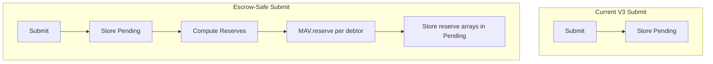
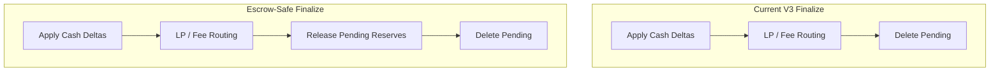

# Escrow Delta Analysis and Test Coverage Plan

## Context

- **CurrentSmartContract.md** documents V3 architecture: ERC1155, MarketRiskManager, checkpoint settlement, 2-bucket vault (free + locked)
- **escrowPlan.md** specifies escrow-safe patches: 3-bucket model (free + reserved + locked), reserve-on-submit, release-on-finalize, cancel escape hatch
- **differences.md** currently holds a flow comparison (Old vs New RetroPick vs Polymarket); the goal is to extend it with the **escrow-plan delta** (V3 vs V3-Escrow)

---

## Part 1: Escrow Plan Delta Analysis

### 1.1 Threat Model (Current vs Escrow-Safe)

| Threat                               | Current (V3)                                                     | Post-Escrow                                               |
| ------------------------------------ | ---------------------------------------------------------------- | --------------------------------------------------------- |
| Withdraw before checkpoint finalizes | User can drain freeBalance; settlement reverts or griefs         | `reservedBalance` blocks withdraw during challenge window |
| Open exposure without locking        | Lock is per-session; no global reserve                           | Reserve covers max debit per user                         |
| LP reserved capital                  | LP can withdraw underlying despite MarketRiskManager reservation | Phase 2: LiquidityVault4626 withdraw limits (future)      |

### 1.2 Contract-Level Changes (Exact Diff Summary)

**MultiAssetVault** (`[src/execution/MultiAssetVault.sol](src/execution/MultiAssetVault.sol)`):

- Add `_reservedBalance[asset][user]`
- Modify `withdraw`: require `amount <= freeBalance - reservedBalance`; use `InsufficientAvailableBalance` instead of `InsufficientFreeBalance`
- Add `reserve(user, asset, amount)` and `release(user, asset, amount)` — `onlyChannelSettlement`
- Add `reservedBalance(user, asset)` and `availableBalance(user, asset)` views
- Add events `Reserved`, `Released`

**CollateralVault** (`[src/execution/CollateralVault.sol](src/execution/CollateralVault.sol)`) (Option A):

- Mirror the same reserve/release semantics for single-asset path
- Add `_reservedBalance[user]`, `reserve(user, amount)`, `release(user, amount)`
- Modify `withdraw` to enforce `free - reserved`
- Add `reservedBalance(user)`, `availableBalance(user)` views

**ChannelSettlement** (`[src/execution/ChannelSettlement.sol](src/execution/ChannelSettlement.sol)`):

- **Pending struct** (lines 44–52): add
  - `address settlementAsset`
  - `address[] reserveUsers`
  - `uint256[] reserveAmts`
  - `uint64 createdAt`
- **Helper** `_computeReserves(marketId, sessionId, deltas, settlementAsset)`: per-user aggregation (bounded O(n^2)), fee-adjusted net cash, return users/amounts for `netCash < 0`
- **Submit path** (`_verifyAndStorePendingMem`, `_verifyAndStorePending`): after storing pending:
  1. Resolve settlement asset (same logic as `_applyCashDeltasAndFees`)
  2. Compute reserve arrays via `_computeReserves`
  3. Call `multiAssetVault.reserve()` or `VAULT.reserve()` for each debtor
  4. Store `settlementAsset`, `reserveUsers`, `reserveAmts`, `createdAt`
- **Replace path** (`challengeCheckpoint` / `isChallenge` branch): call `_releasePendingReserves(key, p)` before overwriting `p`
- **Finalize path**: after applying cash deltas and before `delete pendingByKey[k]`, call `_releasePendingReserves(k, p)`
- **New** `cancelPendingCheckpoint(marketId, sessionId)`: require `block.timestamp >= createdAt + CANCEL_DELAY`, release reserves, delete pending, emit `PendingCheckpointCancelled`
- **Constant**: `CANCEL_DELAY = 6 hours` (or configurable)

**Interfaces**:

- `[IMultiAssetVault.sol](src/interfaces/IMultiAssetVault.sol)`: add `reserve`, `release`, `reservedBalance`, `availableBalance`
- `[ICollateralVault.sol](src/interfaces/ICollateralVault.sol)`: add `reserve`, `release`, `reservedBalance`, `availableBalance`

### 1.3 Data Flow Changes

### 1.4 New Invariants (Post-Escrow)

- Withdraw: `amount <= freeBalance - reservedBalance` (availableBalance)
- Reserve/release only by ChannelSettlement
- On replace: old reserves released before new reserves applied
- On cancel: reserves released and pending cleared after timeout

---

## Part 2: differences.md Document Structure

Proposed structure for `[.docs/differences.md](.docs/differences.md)`:

1. **Keep existing content** (Polymarket/Old vs New flow comparison) as "Part 1: System Flow Comparison" or move to "Appendix A"
2. **Add new "Part 2: Escrow-Safe Upgrade Delta (V3 → V3-Escrow)"**:
  - Threat model summary (what is fixed)
  - Contract-by-contract diff (storage, functions, behavior)
  - Checkpoint flow changes (submit/replace/finalize/cancel)
  - New invariants and access-control updates
  - Phase 2 note (LiquidityVault4626 withdraw limits)
3. **Add "Part 3: Test Coverage Additions"** (or separate section):
  - List of new/modified tests required for escrow-safe patches

---

## Part 3: Test Coverage Plan

### 3.1 New Test File: `test/EscrowFlow.t.sol`

| Test                                            | Description                                                                                        |
| ----------------------------------------------- | -------------------------------------------------------------------------------------------------- |
| `test_Escrow_WithdrawBlockedByReserve`          | Deposit 100, submit checkpoint with user net debit 60, withdraw 50 reverts (available = 40)        |
| `test_Escrow_ReserveReleasedOnFinalize`         | Submit pending with reserve, warp past challenge window, finalize; reserved = 0, withdraw succeeds |
| `test_Escrow_ReserveReplacedOnNewCheckpoint`    | Submit A (reserve 60), challenge with B (reserve 20); assert reserved = 20                         |
| `test_Escrow_CancelPendingReleasesReserve`      | Submit pending, warp + CANCEL_DELAY, cancel; reserves released, pending deleted                    |
| `test_Escrow_ReserveComputationMatchesFeeSplit` | Multi-user checkpoint with fees; verify reserves equal fee-adjusted debit per user                 |
| `test_Escrow_CollateralVaultPath`               | Same scenarios using CollateralVault (no MAV)                                                      |

### 3.2 Modified Test Files

| File                                                      | Changes                                                                                                             |
| --------------------------------------------------------- | ------------------------------------------------------------------------------------------------------------------- |
| `[CheckpointFlow.t.sol](test/CheckpointFlow.t.sol)`       | Uses CollateralVault; add CV reserve/release support. Consider adding MAV + reserve path or defer to EscrowFlow     |
| `[InvariantSolvency.t.sol](test/InvariantSolvency.t.sol)` | Add invariant: `availableBalance <= freeBalance`; consider `reservedBalance` checks around submit/finalize          |
| `[E2EDeployTestnet.t.sol](test/E2EDeployTestnet.t.sol)`   | E2E with MultiAssetVault; add scenario where submit reserves, user cannot withdraw during window, finalize releases |
| `[FeeFlow.t.sol](test/FeeFlow.t.sol)`                     | Ensure reserve computation uses same fee split as `_applyCashDeltasAndFees` (cross-validation)                      |

### 3.3 Edge Cases to Cover

- Replace: release old reserves when `challengeCheckpoint` overwrites pending
- Cancel too early: revert when `block.timestamp < createdAt + CANCEL_DELAY`
- Zero debtors: reserve arrays empty; no MAV calls
- CV-only mode: reserve/release on CollateralVault when `multiAssetVault == 0`

---

## Implementation Order

1. **Phase A (doc)**: Update `.docs/differences.md` with Part 2 (Escrow-Safe Delta) and Part 3 (test plan)
2. **Phase B (contracts)**: Implement patches per escrowPlan (MAV → CV → ChannelSettlement → interfaces)
3. **Phase C (tests)**: Add `EscrowFlow.t.sol`, update CheckpointFlow/InvariantSolvency/E2EDeployTestnet/FeeFlow
4. **Phase D (CurrentSmartContract.md)**: Update architecture doc to reflect escrow-safe state (post-implementation)

---

## Open Questions

- **CANCEL_DELAY**: 6 hours (escrow plan default) or configurable via owner?
- **differences.md scope**: Preserve Polymarket comparison (append) or replace with escrow delta only?
- **CollateralVault**: Escrow plan recommends Option A (add reserve/release). Confirm CV-only production use; if deprecated, Option B (disallow) may simplify.

