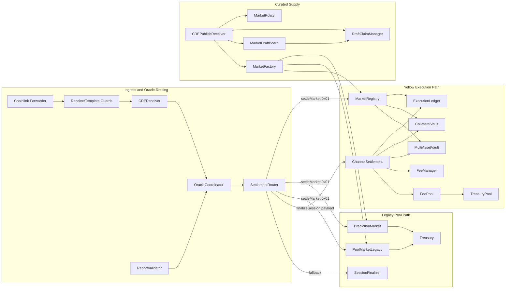
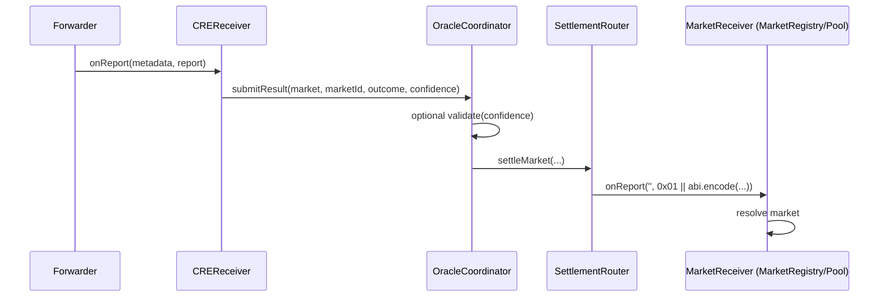
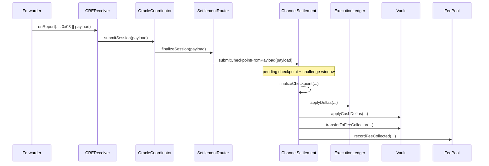
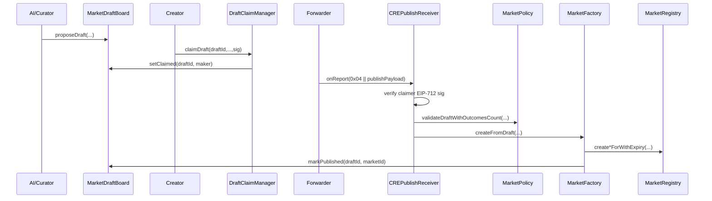
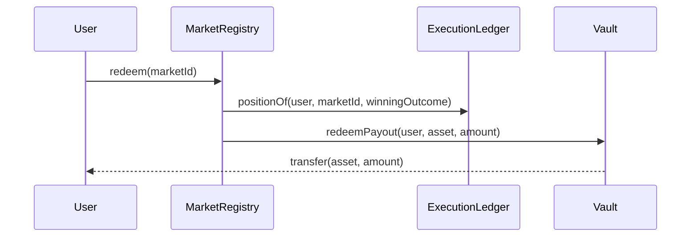
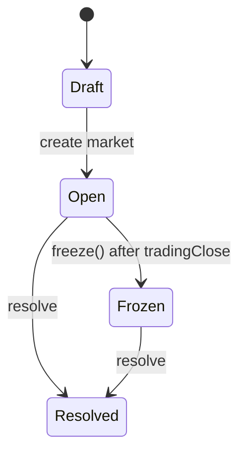
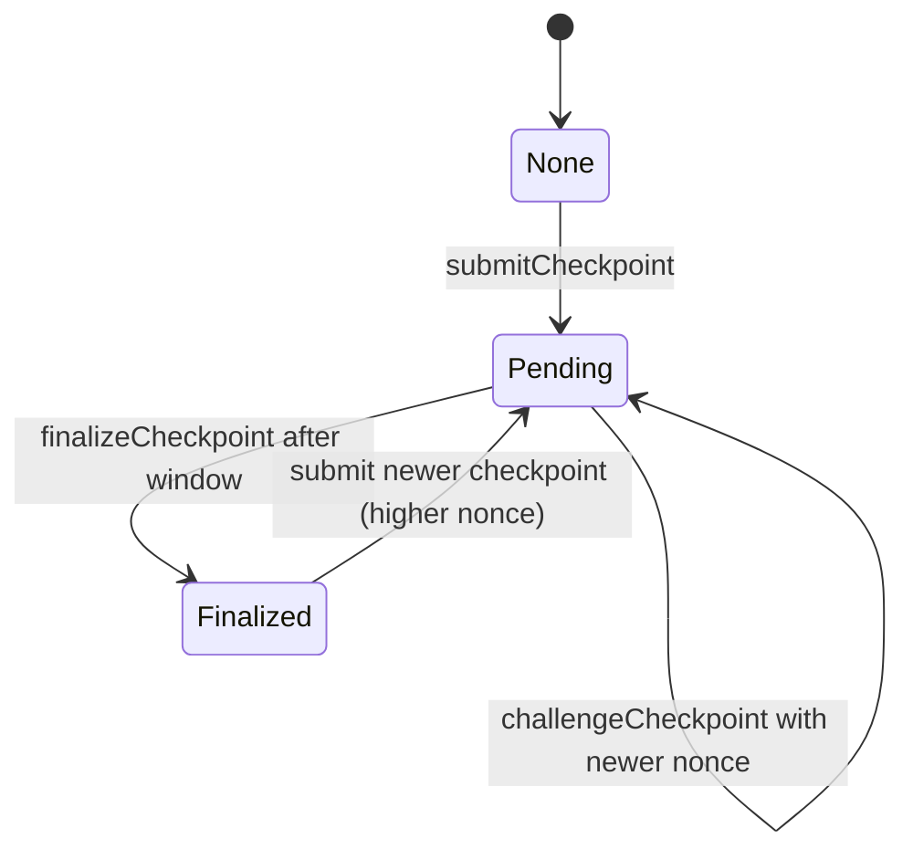
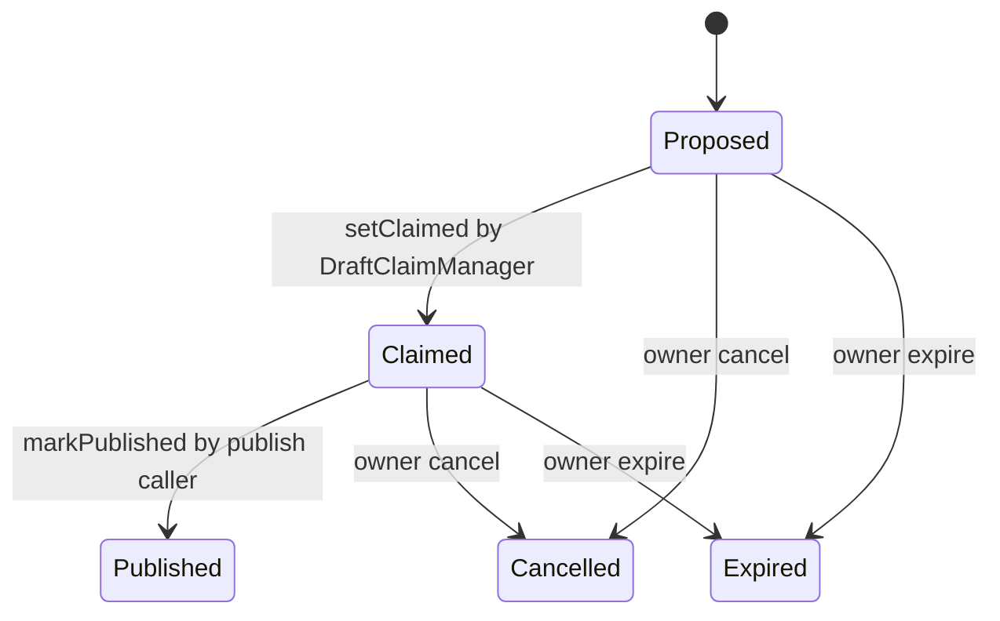

# Current Smart Contract Architecture (Detailed)

Last updated: 2026-02-16  
Repository scope: `packages/contracts`  
Code scope: `src/**` + behavior verification in `test/**`

## 1. Architecture Intent

The current system supports three concurrent product lanes:

1. Legacy pool prediction markets
- `PredictionMarket`
- `PoolMarketLegacy`
- Optional escrow helper: `Treasury`

2. Yellow execution settlement lane (state-checkpoint based)
- `MarketRegistry`
- `ChannelSettlement`
- `ExecutionLedger`
- `CollateralVault` and `MultiAssetVault`

3. Curated market supply lane
- `MarketDraftBoard`
- `DraftClaimManager`
- `MarketPolicy`
- `CREPublishReceiver`
- `MarketFactory.createFromDraft`

Oracle ingress/routing is shared across lanes:
- `ReceiverTemplate` -> `CREReceiver` -> `OracleCoordinator` -> `SettlementRouter`

Fee extraction is implemented on settlement path:
- `FeeManager`
- `FeePool`
- `TreasuryPool`

## 2. System Topology

## 3. Deployment Modes

### 3.1 Legacy Demo Mode

- Market creation and trading in `PredictionMarket` or `PoolMarketLegacy`
- Outcome routing by `SettlementRouter.settleMarket(...)`
- Session settlement (if used) through `SessionFinalizer`

### 3.2 Yellow Execution Mode (recommended current architecture)

- Market state and resolution in `MarketRegistry`
- Offchain trade engine outputs signed checkpoints
- `ChannelSettlement` enforces checkpoint validity + challenge window
- `ExecutionLedger` stores canonical outcome shares
- `CollateralVault` or `MultiAssetVault` applies net cash deltas
- `MarketRegistry.redeem` pays from vault based on winning shares

### 3.3 Curated Mode on top of Yellow

- Draft lifecycle controlled in `MarketDraftBoard`
- Claim attestation through EIP-712 in `DraftClaimManager`
- CRE publish report verified in `CREPublishReceiver`
- Policy gate in `MarketPolicy`
- `MarketFactory.createFromDraft` creates market in `MarketRegistry`

## 4. Trust Boundaries and Security Gates

## 4.1 External trust roots

1. Chainlink Forwarder
- Receiver entrypoints are protected by `ReceiverTemplate` sender checks.

2. Oracle route trust
- `OracleCoordinator` accepts only `creReceiver` sender.
- `SettlementRouter` accepts only `oracleCoordinator` sender.

3. Settlement signer trust
- `ChannelSettlement` trusts `operator` EIP-712 signature plus user signatures.

4. Admin trust
- Owner controls key wiring and configuration across modules.

## 4.2 Ingress schemas (current)

- `CREReceiver`:
  - `0x03` prefixed report => session payload route
  - else => `(market, marketId, outcomeIndex, confidence)` route

- `SettlementRouter`:
  - creates market-settlement report as `0x01 || abi.encode(marketId, outcomeIndex, confidence)`

- `CREPublishReceiver`:
  - accepts raw or `0x04`-prefixed draft publish payload
  - validates draft claim signer using EIP-712

## 4.3 Access-control summary

| Contract | Restricted Operation | Current Guard |
|---|---|---|
| `MarketRegistry` | `resolve` | `msg.sender == settlementRouter` |
| `MarketRegistry` | market creation for others | `msg.sender == marketFactory` |
| `SettlementRouter` | `settleMarket`, `finalizeSession` | `msg.sender == oracleCoordinator` |
| `OracleCoordinator` | `submitResult`, `submitSession` | `msg.sender == creReceiver` |
| `ReportValidator` | `setMinConfidence` | `onlyOwner` |
| `Treasury` | `setMarketApproved` | `onlyOwner` |
| `ExecutionLedger` | `applyDeltas` | `msg.sender == channelSettlement` |
| `CollateralVault` | `applyCashDeltas`, lock/unlock, fee transfer | `msg.sender == channelSettlement` |
| `MultiAssetVault` | `applyCashDeltas`, lock/unlock, fee transfer | `msg.sender == channelSettlement` |
| `FeePool` | `recordFeeCollected` | `msg.sender == feeCollector` |
| `MarketDraftBoard` | `proposeDraft` | `AI_ORACLE_ROLE` |
| `MarketDraftBoard` | `markPublished` | `PUBLISH_CALLER_ROLE` |

## 5. Data Model (Current)

## 5.1 Market model (`MarketRegistry`)

`MarketRegistry.Market` stores:
- `creator`
- `createdAt`
- `expiry`
- `tradingOpen`
- `tradingClose`
- `resolveTime`
- `settledAt`
- `settled`
- `frozen`
- `confidence`
- `outcome` (binary enum)
- `question`

Associated mappings:
- `marketTypeById`
- `categoricalOutcomes[marketId]`
- `timelineWindows[marketId]`
- `typedOutcomeIndex[marketId]`
- `hasRedeemed[marketId][user]`
- `settlementAssetByMarketId[marketId]`

Status derivation:
- no market => `Draft`
- settled => `Resolved`
- frozen => `Frozen`
- otherwise => `Open`

Note:
- Interface enum includes `Closed`, but current implementation does not transition to `Closed`.

## 5.2 Checkpoint model (`ShadowTypes` + `ChannelSettlement`)

`Checkpoint` fields in use:
- `marketId`
- `sessionId`
- `nonce`
- `validAfter`
- `validBefore`
- `lastTradeAt`
- `stateHash`
- `deltasHash`
- `riskHash`

`Delta` fields in use:
- `user`
- `outcomeIndex`
- `sharesDelta`
- `cashDelta`

Per-session state in `ChannelSettlement`:
- `latestNonceByKey`
- `pendingByKey` with `nonce`, `challengeDeadline`, `lastTradeAt`, hashes

## 5.3 Ledger and vault state

- `ExecutionLedger`: `positionOf(user, marketId, outcomeIndex) -> int256`
- `CollateralVault`:
  - `_freeBalance[user]`
  - `_lockedBalance[keccak(user, marketId, sessionId)]`
- `MultiAssetVault`:
  - `_freeBalance[asset][user]`
  - `_lockedBalance[keccak(asset, user, marketId, sessionId)]`

## 5.4 Curated draft state

`MarketDraftBoard.Draft`:
- question hash/URI
- market type
- outcomes hash/URI
- resolve spec hash
- trading open/close
- resolve time
- status (`Proposed`, `Claimed`, `Published`, `Cancelled`, `Expired`)
- creator
- proposed timestamp

`DraftClaimManager.Claim`:
- claimer
- bond
- seed commitment
- claimed timestamp
- expiry

## 6. End-to-End Execution Sequences

## 6.1 Outcome settlement sequence

## 6.2 Session checkpoint sequence

## 6.3 Curated publish sequence

## 6.4 Redemption sequence

## 7. Contract-by-Contract Architecture Notes

## 7.1 `ReceiverTemplate`

Purpose:
- Canonical security wrapper for CRE report entrypoints.

Security features:
- Forwarder sender enforcement
- Optional workflow ID / owner / name checks
- Warning if forwarder is disabled (`address(0)`) via event

Used by:
- `PredictionMarket`
- `PoolMarketLegacy`
- `MarketFactory`
- `CREReceiver`
- `CREPublishReceiver`

## 7.2 `CREReceiver`

Purpose:
- Normalize raw CRE reports into coordinator calls.

Current route split:
- session reports (`0x03`) -> `submitSession`
- result tuples -> `submitResult`

## 7.3 `OracleCoordinator`

Purpose:
- Enforce trusted receiver boundary and optional confidence validation.

Key behavior:
- confidence validation done by low-level call to `reportValidator.validate(uint16)`
- routes to `SettlementRouter` only

## 7.4 `SettlementRouter`

Purpose:
- Dispatch validated oracle outputs to markets/session consumers.

Current architecture traits:
- allowlist-based receiver hardening is implemented but optional (`useReceiverAllowlist`)
- session route preference:
  1. `channelSettlement` if set
  2. else `sessionFinalizer`
- session emit event currently reuses `MarketSettled` placeholder semantics

## 7.5 `MarketRegistry`

Purpose:
- Canonical market state for execution lane.

Important behaviors:
- supports binary/categorical/timeline
- resolution gated to router only
- `freeze` is permissionless once `tradingClose` reached
- redeem is one-time per user per market
- supports legacy single-asset vault or multi-asset vault path

Notable implementation detail:
- create APIs set `tradingClose` and `resolveTime` to `expiry` by default

## 7.6 `ChannelSettlement`

Purpose:
- Checkpoint lifecycle and settlement application.

Validation pipeline:
1. bounds checks (`MAX_DELTAS`, `MAX_USERS`)
2. deltas hash check
3. timing window check (`validAfter`/`validBefore`)
4. operator signature check
5. user signatures check
6. signer coverage checks:
- unique users
- every delta user signed
7. nonce monotonicity and challenge logic

Finalize pipeline:
1. pending existence + challenge window expiration
2. deltas hash matches pending
3. market lifecycle binding:
- reject if market already resolved
- reject if `lastTradeAt > tradingClose`
4. apply share deltas to ledger
5. apply cash deltas net of fees to vault
6. transfer fee to `FeePool` and emit fee record
7. commit nonce and clear pending

Current limitation:
- challenge path still requires operator signature on newer checkpoint.

## 7.7 `ExecutionLedger`

Purpose:
- Canonical position store; no pricing logic onchain.

Invariant:
- no position can become negative (`NegativePosition` revert).

## 7.8 `CollateralVault` and `MultiAssetVault`

Purpose:
- Custody and cash-delta accounting for settlement path.

Common behavior:
- deposit/withdraw user free balances
- lock/unlock per session
- apply signed cash deltas from settlement
- only market registry can pay redemption transfers

Difference:
- `CollateralVault`: single token
- `MultiAssetVault`: per-asset balance domain

Adapter:
- `CollateralVaultAdapter` exposes single-token vault via `IMultiAssetVault`

## 7.9 Fee stack

`FeeManager`:
- owner-settable `protocolFeeBps`
- hard cap `MAX_PROTOCOL_FEE_BPS = 200` (2%)
- fee only on positive pnl delta

`FeePool`:
- receives tokens from vault fee transfer
- records fee accounting events
- owner can sweep assets to treasury pool

`TreasuryPool`:
- long-term treasury balance and controlled spend

## 7.10 Curation stack

`MarketDraftBoard`:
- role-based proposal and publish lifecycle control
- keeps draft registry and statuses

`DraftClaimManager`:
- EIP-712 claim signature verification
- tracks claim metadata and nonce

`MarketPolicy`:
- checks market-type bitmap
- resolve-spec allowlist option
- min/max duration and max outcomes controls

`CREPublishReceiver`:
- verifies draft status and claimer identity
- verifies signed publish params
- calls policy validation
- creates market via factory and marks draft published

## 7.11 Legacy contracts

`PredictionMarket` and `PoolMarketLegacy`:
- pool-based pro-rata payout models
- one-shot prediction per user
- typed markets supported
- used for demo/legacy compatibility

`SessionFinalizer`:
- backend + per-user signed payout snapshot
- direct token transfer fallback path
- no checkpoint challenge mechanism

## 8. State Machines

## 8.1 Registry market lifecycle

## 8.2 Checkpoint lifecycle

## 8.3 Draft lifecycle

## 9. Invariants and Safety Properties

## 9.1 Enforced today

1. Market resolution authority
- unauthorized caller cannot invoke `MarketRegistry.resolve`

2. Checkpoint signer coverage
- no unsigned delta user can be settled

3. Nonce monotonicity
- stale/replayed checkpoint nonce rejected

4. Challenge window
- finalize before window end rejected

5. Trading-close settlement boundary
- `lastTradeAt` after `tradingClose` rejected at finalize

6. Fee cap
- protocol fee cannot exceed 2%

## 9.2 Partially enforced or TODO-level

1. Curated seed economics
- `minCreatorSeed` exists in policy but is not enforced in publish flow

2. Draft timing fidelity
- publish params include trading open/close, but market create path mostly sets timing from expiry only

3. Multi-asset completeness
- asset-aware vault path exists, but asset injection is not yet universal in all creation/report flows

## 10. Tests and Coverage Mapping

Current test files:
- `test/SecurityHardening.t.sol`
- `test/CheckpointFlow.t.sol`
- `test/FeeFlow.t.sol`
- `test/CurationFlow.t.sol`
- `test/OracleFlow.t.sol`
- `test/MarketTypes.t.sol`
- `test/YellowSessionFlow.t.sol`

Coverage highlights:

1. Security hardening
- unauthorized resolve, validator admin, treasury admin
- unsigned delta user rejection
- tradingClose boundary rejection

2. Checkpoint flow
- bad hashes/signatures
- challenge and finalize timing
- nonce progression

3. Fee flow
- positive pnl fee extraction
- fee cap enforcement
- fee accumulation in `FeePool`

4. Curation flow
- draft propose -> claim -> publish -> market creation

5. Oracle routing
- end-to-end CRE receiver to market settlement

6. Legacy session fallback
- `0x03` session report routes to `SessionFinalizer` when configured

## 11. Current Architectural Assessment

The current codebase has already implemented most of the planned P0/P1 hardening and modularization:
- secure routing and access control
- checkpoint signer coverage
- settlement-time fee enforcement
- curated draft lifecycle contracts
- optional multi-asset custody module

Remaining architecture work is mainly in advanced governance and scale layers:
- resolution dispute manager
- checkpoint transcript v2 fields
- risk/sentinel hook layer
- cross-chain CCIP hub-spoke architecture

This document reflects the current deployed code shape, not the aspirational end-state.
