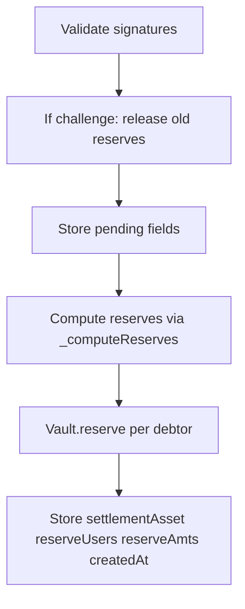
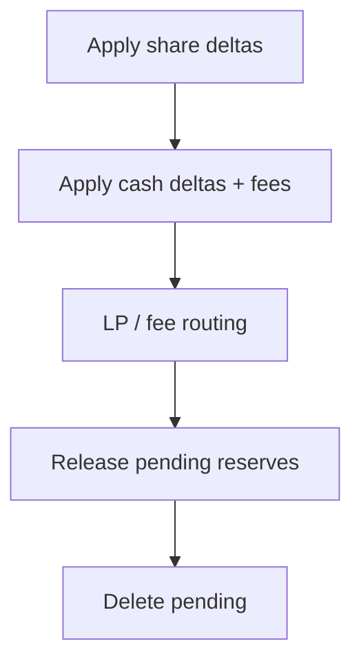

# RetroPick Protocol Differences

**Purpose:** This document captures the delta between:

- **V3 (CurrentSmartContract)** — Current architecture: ERC1155, MarketRiskManager, 2-bucket vault (free + locked), no reserve-on-submit.
- **V3-Escrow** — Escrow-safe target: 3-bucket vault (free + reserved + locked), reserve-on-submit, release-on-finalize, cancel escape hatch.

Reference: [.docs/escrowPlan.md](.docs/escrowPlan.md).

---

# Part A: Escrow-Safe Upgrade Delta (V3 → V3-Escrow)

## A.1 Threat Model Fixed by Escrow Plan

| Threat | Current (V3) | Post-Escrow |
|--------|--------------|-------------|
| **Withdraw before finalize** | User can drain `freeBalance`; settlement reverts or griefs | `reservedBalance` blocks withdraw during challenge window |
| **Open exposure without locking** | Lock is per `(marketId, sessionId)`; no global reserve | Reserve = `max(0, -netCashDelta)` per user after fees |
| **LP reserved capital** | LP can withdraw despite `reserveLpPayout` | Phase 2: LiquidityVault4626 withdraw limits (future) |

## A.2 Contract-by-Contract Diff

### MultiAssetVault ([src/execution/MultiAssetVault.sol](src/execution/MultiAssetVault.sol))

| Change | Details |
|--------|---------|
| Storage | Add `mapping(address asset => mapping(address user => uint256)) private _reservedBalance` |
| withdraw | Replace `_freeBalance < amount` with `amount <= freeBalance - reservedBalance`; revert `InsufficientAvailableBalance` |
| New functions | `reserve(user, asset, amount)`, `release(user, asset, amount)` — `onlyChannelSettlement`; validate `free >= reserved + amount` in reserve |
| New views | `reservedBalance(user, asset)`, `availableBalance(user, asset)` (= free - reserved) |
| Events | `Reserved`, `Released` |
| Errors | `InsufficientAvailableBalance`, `InsufficientReservedBalance` |

### CollateralVault ([src/execution/CollateralVault.sol](src/execution/CollateralVault.sol)) (Option A)

| Change | Details |
|--------|---------|
| Storage | Add `mapping(address => uint256) private _reservedBalance` |
| withdraw | Enforce `amount <= free - reserved` |
| New functions | `reserve(user, amount)`, `release(user, amount)` — `onlyChannelSettlement` |
| New views | `reservedBalance(user)`, `availableBalance(user)` |

### ChannelSettlement ([src/execution/ChannelSettlement.sol](src/execution/ChannelSettlement.sol))

| Change | Details |
|--------|---------|
| Pending struct | Add `address settlementAsset`, `address[] reserveUsers`, `uint256[] reserveAmts`, `uint64 createdAt` |
| New helper | `_resolveSettlementAsset(marketId)` — mirror `_applyCashDeltasAndFees` logic: MAV+registry → `mr.getSettlementAsset(marketId)`, else `VAULT.token()` |
| New helper | `_computeReserves(marketId, sessionId, deltas, settlementAsset)` — per-user aggregation (bounded O(n^2)), same fee logic as `_applyCashDeltasAndFees`, return `(users[], amts[])` for users with `netCash < 0` |
| New helper | `_releasePendingReserves(bytes32 k, Pending storage p)` — iterate `reserveUsers`/`reserveAmts`, call MAV.release or VAULT.release |
| Submit path | After storing pending: if `isChallenge`, first call `_releasePendingReserves`; then resolve settlement asset, compute reserves, call reserve for each debtor, store arrays and `createdAt` |
| Finalize path | After `_applyCashDeltasAndFees` and LP/fee routing, **before** `delete pendingByKey[k]`, call `_releasePendingReserves(k, p)` |
| New function | `cancelPendingCheckpoint(marketId, sessionId)` — require `block.timestamp >= createdAt + CANCEL_DELAY`, release reserves, delete pending, emit `PendingCheckpointCancelled` |
| Constant | `CANCEL_DELAY = 6 hours` |

### Interfaces

- [src/interfaces/IMultiAssetVault.sol](src/interfaces/IMultiAssetVault.sol): add `reserve`, `release`, `reservedBalance`, `availableBalance`
- [src/interfaces/ICollateralVault.sol](src/interfaces/ICollateralVault.sol): add `reserve`, `release`, `reservedBalance`, `availableBalance`

## A.3 Checkpoint Flow Changes

### Submit / Challenge



### Finalize



## A.4 New Invariants (Post-Escrow)

- Withdraw: `amount <= availableBalance = freeBalance - reservedBalance`
- Reserve/release only by ChannelSettlement
- On replace: old reserves released before new reserves applied
- On cancel: reserves released and pending cleared after `createdAt + CANCEL_DELAY`

## A.5 Phase 2 Note (Future)

LiquidityVault4626 withdraw limits: add `riskManager` reference and `amount <= totalAssets - reserved` in `withdraw`/`redeem`. Out of scope for initial escrow patch.

---

# Part B: Test Coverage Additions

## B.1 New Test File: `test/EscrowFlow.t.sol`

| Test | Description |
|------|-------------|
| `test_Escrow_WithdrawBlockedByReserve` | Deposit 100, submit checkpoint with user net debit 60, withdraw 50 reverts (available = 40) |
| `test_Escrow_ReserveReleasedOnFinalize` | Submit pending, warp past challenge window, finalize; reserved = 0, withdraw succeeds |
| `test_Escrow_ReserveReplacedOnNewCheckpoint` | Submit A (reserve 60), challenge with B (reserve 20); assert reserved = 20, not 80 |
| `test_Escrow_CancelPendingReleasesReserve` | Submit pending, warp + CANCEL_DELAY, cancel; reserves released, pending deleted |
| `test_Escrow_ReserveComputationMatchesFeeSplit` | Multi-user checkpoint with fees; verify reserves equal fee-adjusted debit per user |
| `test_Escrow_CollateralVaultPath` | Same scenarios using CollateralVault (no MAV), if CV path is implemented |

## B.2 Modified Test Files

| File | Changes |
|------|---------|
| [test/CheckpointFlow.t.sol](test/CheckpointFlow.t.sol) | Uses CollateralVault; after CV reserve/release, ensure submit/finalize still pass; optionally add reserve path assertion |
| [test/InvariantSolvency.t.sol](test/InvariantSolvency.t.sol) | Add invariant: `availableBalance <= freeBalance`; consider reservedBalance checks around submit/finalize |
| [test/E2EDeployTestnet.t.sol](test/E2EDeployTestnet.t.sol) | If uses MAV: add scenario where submit reserves, user cannot withdraw during window, finalize releases |
| [test/FeeFlow.t.sol](test/FeeFlow.t.sol) | Ensure reserve computation uses same fee split; cross-validate with `_computeReserves` |

## B.3 Edge Cases to Cover

- Replace: release old reserves when `challengeCheckpoint` overwrites pending
- Cancel too early: revert when `block.timestamp < createdAt + CANCEL_DELAY`
- Zero debtors: reserve arrays empty; no vault reserve calls
- CV-only mode: reserve/release on CollateralVault when `multiAssetVault == 0`

---

# Appendix: Prediction Market System Flow Comparison

Comparison of Old RetroPick (V2), New RetroPick (V3), and Polymarket across lifecycle stages.

## Systems Compared

| System | Description |
|--------|-------------|
| **Old RetroPick (V2)** | Ledger-based positions + checkpoint settlement + implicit LP underwriting |
| **New RetroPick (V3)** | ERC1155 outcome tokens + locked transfer + risk reservation underwriting |
| **Polymarket** | ERC1155 Conditional Tokens + onchain Exchange settlement |

## Master Flow Overview

```
User → Frontend UX → Order Authorization → Trading Execution → Collateral Custody
→ Position Accounting → Oracle Resolution → Redemption
```

## Lifecycle Comparison Tables

### Market Creation

| Step | Old RetroPick | New RetroPick | Polymarket |
|------|---------------|---------------|------------|
| Market idea | AI proposer or creator submits draft | Same | Internal curated market creators |
| Liquidity | claimAndSeed deposits ERC4626 vault | Same | No LP underwriting |
| Collateral | LP seed | LP seed defines exposure cap | Market creator provides liquidity pools |

### User Deposit / Custody

| Step | Old RetroPick | New RetroPick | Polymarket |
|------|---------------|---------------|------------|
| Custody | MultiAssetVault holds funds | Same | Exchange contract escrow |

### Trade Authorization

| Step | Old RetroPick | New RetroPick | Polymarket |
|------|---------------|---------------|-----------|
| Authorization | user signs checkpoint participation | Same | user signs EIP712 order intent |

### Position Accounting

| Step | Old RetroPick | New RetroPick | Polymarket |
|------|---------------|---------------|------------|
| Accounting | Ledger entry | ERC1155 mint burn | ERC1155 transfer |
| Wallet visibility | none | yes | yes |
| Transferability | none | locked until resolved | transferable always |

### Cash Settlement

| Step | Old RetroPick | New RetroPick | Polymarket |
|------|---------------|---------------|------------|
| Counterparty | LP vault | LP vault | market participants |
| Risk bound | none | capped | full collateralization |

### Gas Costs

| | Old RetroPick | New RetroPick | Polymarket |
|---|---------------|---------------|------------|
| Trade gas | zero | zero | exchange tx |
| Settlement | batch | batch | every fill |

### Complete Lifecycle Summary

| Stage | Winner |
|-------|--------|
| UX speed | RetroPick |
| wallet composability | New RetroPick |
| safety | New RetroPick + Polymarket tie |
| capital efficiency | New RetroPick |
| decentralization | Polymarket |
