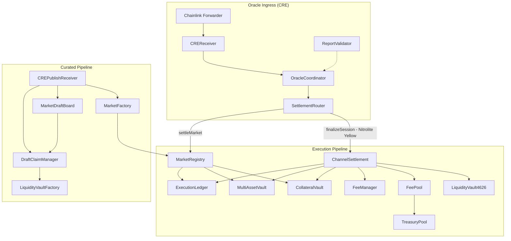
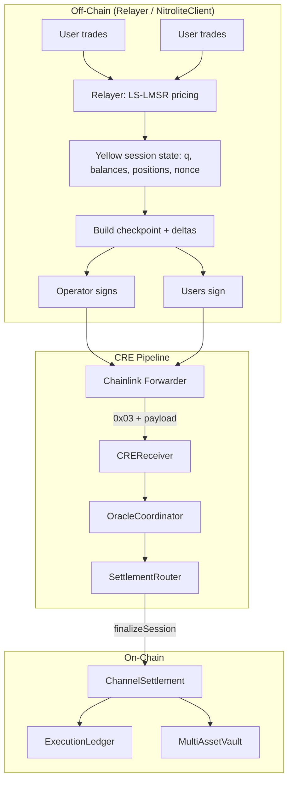
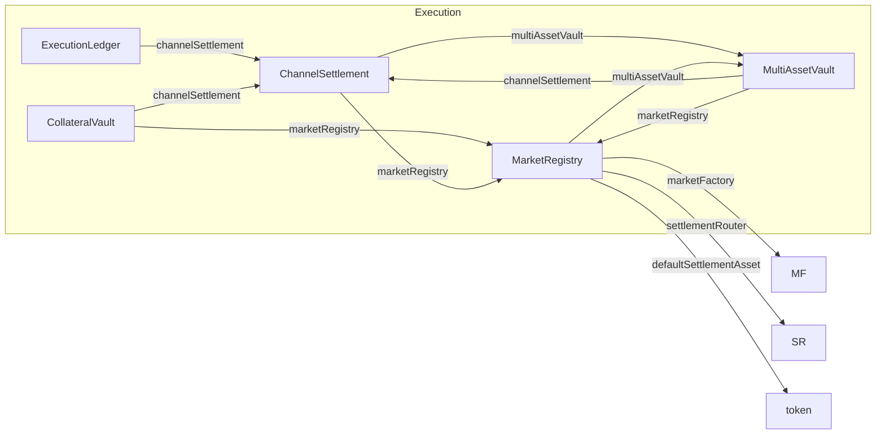
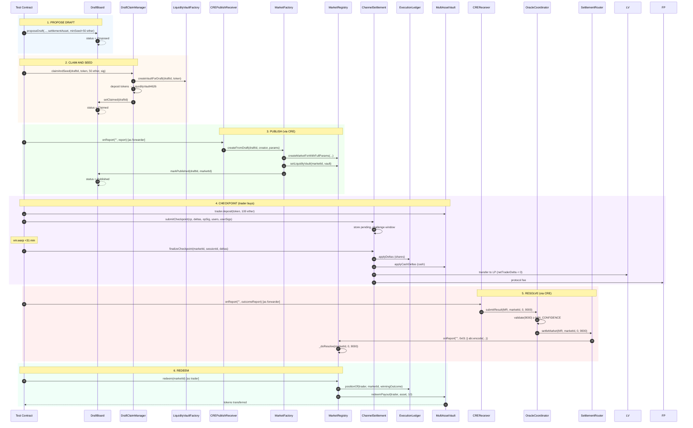
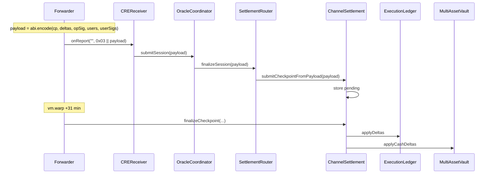
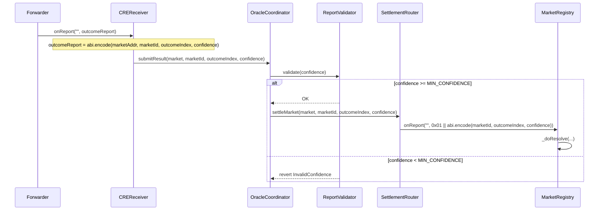

# RetroPick E2E Test Documentation (Avalanche Fuji / Testnet)

**Last updated:** 2026-02-19  
**Scope:** `test/E2EDeployTestnet.t.sol` + full smart contract architecture  
**Target:** Avalanche Fuji (43113) deployment validation via mirror topology

---

## 1. Executive Summary

The E2E test suite validates the **production lane** of the RetroPick prediction market system end-to-end, from market creation through settlement to user redemption. Tests mirror the exact contract topology deployed via `script/DeployTestnet.s.sol` on Avalanche Fuji and documented in `deployment/deploymentAvalancheFuji.md`.

The deployment script deploys the **CRE + Nitrolite Yellow checkpoint** stack: checkpoint-based settlement via `ChannelSettlement`, not the legacy `SessionFinalizer` snapshot path.


Nitrolite Yellow session content has been added to the E2E doc. Here's what changed:

## Analysis Summary: Where Nitrolite Yellow Was Added

### 1. **Executive Summary (Section 1)**
- Describes the deployment as the **CRE + Nitrolite Yellow checkpoint** stack.
- Primary path updated to: `Curated Draft → claimAndSeed → Publish → Nitrolite Yellow Checkpoint Settlement → Oracle Resolution → Redeem`.

### 2. **New Section 2.3: Nitrolite Yellow Session – Conceptual Model**
- **What is Nitrolite Yellow:** Yellow sessions, checkpoints, deltas, Nitrolite, operator.
- **Nitrolite Yellow vs legacy Yellow:** Comparison of:
  - **Nitrolite (Production):** ChannelSettlement, checkpoint + deltas payload, operator + user signatures.
  - **Legacy Yellow:** SessionFinalizer, snapshot payload, backend + participant signatures. Not used in DeployTestnet.
- **Lifecycle diagram:** Off-chain relayer → checkpoint build → CRE 0x03 → on-chain finalize (Mermaid flowchart).

### 3. **Contract Inventory (Section 2.2)**
- ChannelSettlement marked as the **Nitrolite Yellow** checkpoint settlement contract.

### 4. **Architecture Diagram**
- SettlementRouter → ChannelSettlement label updated to: `finalizeSession (Nitrolite Yellow)`.

### 5. **Section 5.2 Retitled**
- "Session Payload" renamed to **"Nitrolite Yellow Session Payload"**.
- Explanation added for the relayer’s `buildCheckpointPayload` and CRE routing.

### 6. **Data Structures (Section 6)**
- Intro added that Nitrolite Yellow uses `Checkpoint` and `Delta`, built by the relayer.
- CREReceiver report table: extra "Nitrolite Yellow" column; `0x03` explicitly noted as the Nitrolite Yellow checkpoint payload.

### 7. **Test Assertions (Section 7)**
- New subsection: **"Nitrolite Yellow Coverage in E2E Tests"**.
- Table updated with a "Nitrolite Yellow component" column for each test.

### 8. **Fuji Mapping (Section 9)**
- **Section 9.1:** "Nitrolite Yellow + Relayer Integration" with:
  - Env vars: `CHANNEL_SETTLEMENT_ADDRESS`, `OPERATOR_PRIVATE_KEY`.
  - Step-by-step flow on Fuji (relayer → NitroliteClient → checkpoint build → CRE → ChannelSettlement).
  - Note that steps 3–5 are covered by E2E; steps 1–2 are covered in relayer integration tests.

### 9. **References (Section 11)**
- Relayer (Nitrolite Yellow) and `YellowSessionFlow.t.sol` (legacy path) added.

**Primary validation path:**

```
Curated Draft → claimAndSeed → Publish → Nitrolite Yellow Checkpoint Settlement → Oracle Resolution → Redeem
```

All flows pass through Chainlink CRE (Chainlink Request-and-Execute) receivers and enforce the trust boundaries defined in `docs/CurrentSmartContract.md`.

---


Here’s why Nitrolite Yellow sessions don’t talk to the smart contracts directly and instead go through CRE.

---

## Why Nitrolite Yellow Goes Through CRE Instead of Directly to the Contracts

### Current flow

1. **Relayer** (NitroliteClient, off-chain):
   - Runs Yellow sessions (off-chain trading).
   - Builds checkpoint payload (operator + user sigs).
   - Exposes HTTP: `GET /cre/checkpoints/:sessionId`, `POST /cre/checkpoints/:sessionId`.
   - Serves payloads and does not send any on-chain transactions.

2. **CRE workflow** (Chainlink):
   - Fetches checkpoint payload from the relayer (via HTTP).
   - Uses `evmClient.writeReport()` to send a transaction.
   - That transaction is routed through the Chainlink Forwarder and ends up calling `CREReceiver.onReport()`.

3. **On-chain:**
   ```
   Forwarder → CREReceiver.onReport() → OracleCoordinator.submitSession() 
            → SettlementRouter.finalizeSession() → ChannelSettlement.submitCheckpointFromPayload()
   ```

---

### Why not relayer → contract directly?

#### 1. **Only the Forwarder can call `CREReceiver`**

`ReceiverTemplate` in `CREReceiver` restricts who can call `onReport`:

```solidity
// ReceiverTemplate: only sForwarderAddress can call onReport
if (sForwarderAddress != address(0) && msg.sender != sForwarderAddress) {
    revert InvalidSender(msg.sender, sForwarderAddress);
}
```

So `relayer → CREReceiver.onReport()` would revert because `msg.sender` would be the relayer, not the Forwarder.

#### 2. **ChannelSettlement could be called directly**

`ChannelSettlement.submitCheckpoint()` and `submitCheckpointFromPayload()` are not restricted by caller; they only verify operator and user signatures. So in theory the relayer could:

- Call `SettlementRouter.finalizeSession()` directly

But `SettlementRouter.finalizeSession` is `onlyOracleCoordinator`:

```solidity
function finalizeSession(bytes calldata payload) external override onlyOracleCoordinator {
```

Only `OracleCoordinator` can call it, and `OracleCoordinator.submitSession` is `onlyReceiver`, i.e. only `CREReceiver` can call it. So the intended path is: CRE (via Forwarder) → CREReceiver → OracleCoordinator → SettlementRouter → ChannelSettlement.

The relayer could also call `ChannelSettlement.submitCheckpoint()` directly (it’s public and has no access control). That would work from a pure contract perspective, but it’s not how the stack is designed.

---

### Why the CRE path was chosen

1. **Single, trusted entry point**

   All oracle and settlement flows (outcome resolution + checkpoint sessions) enter via CREReceiver, which only accepts calls from the Chainlink Forwarder.

2. **Chainlink CRE integration**

   The system is built for Chainlink CRE. CRE workflows:
   - Decide when to run (cron, triggers).
   - Fetch data from the relayer.
   - Use Chainlink signing and `writeReport`.
   - Rely on the Forwarder to deliver reports.

3. **Separation of concerns**

   - **Relayer:** Session state, pricing, signatures, API. No blockchain calls.
   - **CRE workflow:** Orchestration and the actual on-chain writes through CRE.
   - **Forwarder:** Trusted executor that can call `onReport`.

4. **Unified treatment of resolution and checkpoints**

   Outcome resolution and checkpoint settlement both use the same CRE path. Keeping them consistent simplifies trust and architecture.

---

### Flow overview

```
Relayer (Nitrolite)          CRE Workflow                On-Chain
─────────────────           ─────────────               ────────
Session state               
  ↓                         
Build checkpoint            
  ↓                         
HTTP: POST /cre/            Fetch payload               
checkpoints/:id  ─────────→ Build report                
  ↓                         writeReport()  ──────────→  Forwarder
                                                              ↓
                                                    CREReceiver.onReport()
                                                              ↓
                                                    OracleCoordinator
                                                              ↓
                                                    SettlementRouter
                                                              ↓
                                                    ChannelSettlement
```

So Nitrolite Yellow sessions do not talk to the smart contracts directly because the design routes all such settlement through CRE and the Chainlink Forwarder. The relayer prepares signed data; the CRE workflow delivers it on-chain.

## 2. Architecture Overview

### 2.1 High-Level Topology



### 2.2 Contract Inventory (DeployTestnet Topology)

| Layer       | Contract            | Role                                                                 |
|------------|---------------------|----------------------------------------------------------------------|
| **Execution** | ExecutionLedger     | Per-(market, user, outcome) share positions                          |
|             | ChannelSettlement   | **Nitrolite Yellow** checkpoint verification, operator/user signatures, LP counterparty |
|             | MultiAssetVault     | Per-asset custody; used for cash deltas when MAV configured          |
|             | CollateralVault     | Single-token fallback; MarketRegistry VAULT for redeem path          |
|             | MarketRegistry      | Market metadata, resolution, redeem from ledger + vault                |
| **Fees**   | FeeManager          | Protocol/LP/creator fee split (bps)                                  |
|             | FeePool             | Protocol fee collection                                              |
|             | TreasuryPool        | LP fee fallback when vault has zero supply                           |
| **Oracle** | ReportValidator     | Minimum confidence threshold for resolution reports                   |
|             | CREReceiver         | CRE entrypoint; routes outcome (0x01) and session (0x03) reports       |
|             | OracleCoordinator   | Validates confidence, forwards to SettlementRouter                   |
|             | SettlementRouter    | Routes to MarketRegistry (settle) or ChannelSettlement (session)     |
| **Curation** | MarketPolicy       | Policy checks (e.g. min creator seed)                                 |
|             | MarketDraftBoard    | Draft lifecycle: Proposed → Claimed → Published                      |
|             | DraftClaimManager   | claimDraft / claimAndSeed; custody of locked seed shares             |
|             | LiquidityVaultFactory | Per-draft ERC-4626 vault deployment                                |
|             | CREPublishReceiver  | CRE entrypoint for publish-from-draft reports                         |
|             | MarketFactory       | createFromDraft; binds liquidity vault to market                     |

---

## 2.3 Nitrolite Yellow Session: Conceptual Model

### What Is Nitrolite Yellow?

**Nitrolite Yellow** refers to the checkpoint-based settlement path used by the production stack. Trading executes **off-chain** in hub-and-spoke state channels ("Yellow sessions"); on-chain contracts retain custody, enforce signed state commitments, and handle dispute exits. The whitepaper specifies: *"latest signed state wins"* in challenge windows.

| Concept | Meaning |
|---------|---------|
| **Yellow session** | Per-market/per-session off-chain trading channel; gasless; deterministic LS-LMSR pricing |
| **Checkpoint** | Signed state commitment: `(marketId, sessionId, nonce, stateHash, deltasHash)` |
| **Deltas** | Netted effects per user: `(user, outcomeIndex, sharesDelta, cashDelta)` |
| **Nitrolite** | Yellow Network SDK (`@erc7824/nitrolite`); relayer uses it for custody/adjudicator setup |
| **Operator** | Trusted signer; signs checkpoints; same key as relayer's `OPERATOR_PRIVATE_KEY` |

### Nitrolite Yellow vs Legacy Yellow

The codebase has **two** Yellow session implementations. DeployTestnet and E2E tests use **only** the Nitrolite (checkpoint) path.

| Aspect | Nitrolite Yellow (Production) | Legacy Yellow |
|--------|-------------------------------|---------------|
| **Contract** | `ChannelSettlement` | `SessionFinalizer` |
| **Payload** | `(Checkpoint, Delta[], opSig, users, userSigs)` | `SessionPayload{participants, balances, signatures, backendSignature}` |
| **Signing** | Operator + every delta user | Backend + each participant |
| **State model** | Deltas (incremental) | Balances snapshot |
| **Deployed in DeployTestnet** | Yes | No |
| **E2E coverage** | Yes (`testE2E_CheckpointViaSessionPayload`, full path) | No (see `test/YellowSessionFlow.t.sol`) |

### Nitrolite Yellow Lifecycle (Off-Chain → On-Chain)



1. **Off-chain:** Users trade via relayer API (`/api/trade/buy`, `/api/trade/swap`). Relayer maintains session state (positions, balances, nonce). LS-LMSR pricing runs off-chain.
2. **Checkpoint build:** Relayer builds `Checkpoint` + `Delta[]`, operator and users sign. CRE workflow fetches payload from `GET /cre/checkpoints` or similar.
3. **On-chain ingress:** CRE sends `0x03 || payload` to CREReceiver → OracleCoordinator → SettlementRouter → `ChannelSettlement.submitCheckpointFromPayload`.
4. **Challenge window:** 30 minutes; users can challenge with newer nonce.
5. **Finalize:** After window, anyone calls `ChannelSettlement.finalizeCheckpoint`; shares and cash deltas applied.

---

## 3. Critical Wiring (DeployTestnet Truth)

The E2E test replicates the exact wiring in `DeployTestnet.s.sol`. These links **must** be correct for end-to-end flows.



### 3.1 Execution Lane Wiring

| From                 | To                 | Setter / Link                           |
|----------------------|--------------------|-----------------------------------------|
| ExecutionLedger      | ChannelSettlement  | `setChannelSettlement`                  |
| MultiAssetVault      | ChannelSettlement   | `setChannelSettlement`                  |
| MultiAssetVault      | MarketRegistry     | `setMarketRegistry`                     |
| CollateralVault      | ChannelSettlement   | `setChannelSettlement`                  |
| CollateralVault      | MarketRegistry     | `setMarketRegistry`                     |
| ChannelSettlement     | MarketRegistry     | `setMarketRegistry`                     |
| ChannelSettlement     | MultiAssetVault    | `setMultiAssetVault`                     |
| MarketRegistry       | MultiAssetVault    | `setMultiAssetVault`                    |
| MarketRegistry       | DefaultSettlementAsset | `setDefaultSettlementAsset`         |

### 3.2 Oracle + Fees Wiring

| From                 | To                 | Link                                    |
|----------------------|--------------------|-----------------------------------------|
| OracleCoordinator    | CREReceiver        | `setCreReceiver`                        |
| OracleCoordinator    | SettlementRouter   | `setSettlementRouter`                   |
| OracleCoordinator    | ReportValidator    | `setReportValidator`                   |
| SettlementRouter     | OracleCoordinator  | `setOracleCoordinator`                  |
| SettlementRouter     | ChannelSettlement  | `setChannelSettlement`                  |
| SettlementRouter     | MarketRegistry     | `setMarketReceiverApproved(registry, true)` |
| FeePool             | ChannelSettlement  | `setFeeCollector`                       |
| FeePool             | TreasuryPool       | `setTreasuryPool`                       |
| ChannelSettlement    | FeeManager         | `setFeeManager`                        |
| ChannelSettlement    | FeePool            | `setFeePool`                            |

### 3.3 Curated Lane Wiring

| From                 | To                 | Link                                    |
|----------------------|--------------------|-----------------------------------------|
| MarketDraftBoard     | DraftClaimManager  | `setDraftClaimManager`                  |
| MarketDraftBoard     | MarketFactory      | `PUBLISH_CALLER_ROLE` granted           |
| DraftClaimManager    | LiquidityVaultFactory | `setLiquidityVaultFactory`           |
| LiquidityVaultFactory| ChannelSettlement  | constructor + `setChannelSettlement`    |
| MarketFactory        | MarketRegistry     | `setMarketRegistry`                    |
| MarketFactory        | MarketDraftBoard   | `setDraftBoard`                         |
| MarketFactory        | DraftClaimManager  | `setDraftClaimManager`                  |
| MarketFactory        | CREPublishReceiver | `approvedPublishReceivers[CPR] = true`  |
| MarketRegistry       | MarketFactory      | `setMarketFactory`                     |

---

## 4. E2E Test File: `test/E2EDeployTestnet.t.sol`

### 4.1 Purpose and Scope

`E2EDeployTestnetTest` exercises the full production path in a single test environment, using the same 17 contracts and wiring as `DeployTestnet.s.sol`. It does **not** deploy PoolMarketLegacy or SessionFinalizer.

### 4.2 Test Configuration (Constants)

| Constant             | Value  | Meaning                                                |
|----------------------|--------|--------------------------------------------------------|
| `MIN_CONFIDENCE`     | 8000   | ReportValidator threshold (80% in basis-point-like)     |
| `PROTOCOL_FEE_BPS`   | 100    | 1% total fee cap                                      |
| `LP_FEE_SHARE_BPS`   | 2000   | 20% of fee to LP vault                                 |
| `CREATOR_FEE_SHARE_BPS` | 1000| 10% of fee to market creator                          |

### 4.3 Actors and Keys

| Actor   | Variable   | Private Key  | Role                                              |
|---------|------------|--------------|---------------------------------------------------|
| Operator| `operator` | `0xA11CE`    | Signs checkpoints; ChannelSettlement trusts this |
| Creator | `creator`  | `0xBEEF`     | Proposes draft, claimAndSeed, signs publish      |
| Trader  | `trader`   | `0xC0DE`     | Deposits, trades (checkpoint deltas), redeems    |
| Forwarder| `forwarder`| `0xF0`      | Simulated Chainlink Forwarder for CRE calls       |
| Test contract | (this) | —       | Holds `AI_ORACLE_ROLE` to propose drafts         |

### 4.4 MultiAssetVault vs CollateralVault: Critical Detail

When `MultiAssetVault` is configured (as in DeployTestnet), the ChannelSettlement uses **MultiAssetVault** for `applyCashDeltas`, not CollateralVault. Therefore:

- **User deposits must go to `MultiAssetVault.deposit(asset, amount)`**, not `CollateralVault.deposit(amount)`.
- `MarketRegistry.redeem` uses `multiAssetVault.redeemPayout` when MAV is set.
- CollateralVault remains the immutable `VAULT` for MarketRegistry, but the execution path prefers MAV when present.

---

## 5. E2E Flow Diagrams (Step by Step)

### 5.1 Full Production Path: `testE2E_CuratedDraftClaimPublishCheckpointResolveRedeem`

This test runs the complete lifecycle from draft proposal to user redemption.



#### 5.1.1 Step-by-Step Example (Concrete Values)

| Step | Action | State Change |
|------|--------|--------------|
| **1. Propose** | `draftBoard.proposeDraft(questionHash, ..., settlementToken, 50 ether)` | Draft status = Proposed |
| **2. Claim** | Creator signs EIP-712 `ClaimAndSeed`, calls `claimAndSeed(draftId, token, 50e18, 0, sig)` | LP vault deployed; 50 ether deposited; status = Claimed |
| **3. Publish** | Forwarder calls `crePublishReceiver.onReport("", abi.encode(draftId, creator, params, sig))` | Market created (id=0); vault bound; status = Published |
| **4. Checkpoint** | Trader deposits 100 ether to MAV. Operator + trader sign checkpoint. Submit → wait 31 min → finalize. | Ledger: `positionOf(trader, 0, 0) = 10`; MAV: trader balance = 100e18 - 1000 |
| **5. Resolve** | Forwarder calls `creReceiver.onReport("", abi.encode(MarketRegistry, 0, 0, 9000))` | Market settled, outcome=0, confidence=9000 |
| **6. Redeem** | Trader calls `marketRegistry.redeem(0)` | Payout = 10 tokens; `hasRedeemed[0][trader] = true` |

---

### 5.2 Nitrolite Yellow Session Payload (Checkpoint via CRE): `testE2E_CheckpointViaSessionPayload`

Validates the **Nitrolite Yellow** checkpoint path: payloads submitted via CRE (report type `0x03`) route to `ChannelSettlement.submitCheckpointFromPayload`. This mirrors the relayer's `buildCheckpointPayload` output sent by CRE workflows.



**Report format for session payload:**

```
report = bytes1(0x03) || abi.encode(Checkpoint, Delta[], operatorSig, address[] users, bytes[] userSigs)
```

---

### 5.3 Oracle Resolution: `testE2E_OracleResolvesMarketRegistry` & `testE2E_OracleResolutionBelowMinConfidenceReverts`



**Outcome report format (non-session):**

```
report = abi.encode(address market, uint256 marketId, uint8 outcomeIndex, uint16 confidence)
```

---

## 6. Data Structures and Formats

The Nitrolite Yellow session uses `Checkpoint` and `Delta` for on-chain settlement. The relayer builds these from off-chain session state.

### 6.1 Checkpoint (`ShadowTypes.Checkpoint`)

| Field       | Type    | Purpose |
|-------------|---------|---------|
| `marketId`  | uint256 | Target market |
| `sessionId` | bytes32 | Session identifier (per market/session) |
| `nonce`     | uint64  | Strictly increasing; replay protection |
| `validAfter`| uint64  | Optional validity start |
| `validBefore`| uint64 | Optional validity end |
| `lastTradeAt`| uint48 | Must be ≤ `market.tradingClose` |
| `stateHash` | bytes32 | Offchain state commitment |
| `deltasHash`| bytes32 | keccak256 of Delta[] (must match payload) |
| `riskHash`  | bytes32 | Optional risk data |

### 6.2 Delta (`ShadowTypes.Delta`)

| Field        | Type  | Meaning |
|--------------|-------|---------|
| `user`       | address | Affected user |
| `outcomeIndex`| uint32 | Outcome (0=Yes, 1=No for binary) |
| `sharesDelta`| int128 | Change in ExecutionLedger position |
| `cashDelta`  | int128 | Change in vault balance (negative = spend) |

### 6.3 CREReceiver Report Types

| First Byte | Type    | Payload | Action | Nitrolite Yellow |
|------------|---------|---------|--------|------------------|
| `0x03`     | Session | `abi.encode(Checkpoint, Delta[], opSig, users, userSigs)` | `oracleCoordinator.submitSession(payload)` → `ChannelSettlement` | Yes |
| (default)  | Outcome | `abi.encode(market, marketId, outcomeIndex, confidence)`   | `oracleCoordinator.submitResult(...)` → MarketRegistry | No |

The `0x03` session report is the **Nitrolite Yellow checkpoint payload**. The relayer builds it; CRE workflow sends it to CREReceiver.

---

## 7. Test Assertions Summary

### Nitrolite Yellow Coverage in E2E Tests

| Test | Nitrolite Yellow component | Assertions |
|------|----------------------------|------------|
| **testE2E_CuratedDraftClaimPublishCheckpointResolveRedeem** | Full path incl. **Nitrolite Yellow checkpoint** (submit + finalize) | Draft Proposed→Claimed→Published; market id 0; vault bound; ledger position 10; MAV balance 100e18-1000; settled outcome 0, confidence 9000; redeem payout 10 |
| **testE2E_CheckpointViaSessionPayload** | **Nitrolite Yellow session** (0x03 CRE path) | Checkpoint via 0x03 accepted; finalize; ledger position 10 |
| **testE2E_OracleResolvesMarketRegistry** | Outcome resolution (not Yellow) | Market settled, outcome 1, confidence 9500 |
| **testE2E_OracleResolutionBelowMinConfidenceReverts** | ReportValidator (not Yellow) | `creReceiver.onReport` with confidence 5000 reverts (5000 < 8000) |

---

## 8. Running the E2E Tests

```bash
# Run only E2E tests
forge test --match-contract E2EDeployTestnetTest

# Run with verbosity
forge test --match-contract E2EDeployTestnetTest -vvv

# Run full suite (including E2E)
forge test
```

Expected: 4 passed for `E2EDeployTestnetTest`; full suite ~46 tests.

---

## 9. Mapping to Avalanche Fuji Deployment

The E2E test topology matches the Fuji deployment in `deployment/deploymentAvalancheFuji.md`. Key mappings:

| Test Component   | Fuji Deployment |
|------------------|-----------------|
| `forwarder`      | `CHAINLINK_FORWARDER` (Chainlink CRE forwarder on Fuji) |
| `operator`       | `OPERATOR` address (relayer checkpoint signer) |
| `settlementToken`| `SETTLEMENT_TOKEN` (e.g. USDC test token) |
| `_deployFullStack()` | `script/DeployTestnet.s.sol` run output |

### 9.1 Nitrolite Yellow + Relayer Integration

The relayer (`apps/relayer`) is the **Nitrolite Yellow session** execution layer. It uses:

| Env Variable | Purpose |
|--------------|---------|
| `CHANNEL_SETTLEMENT_ADDRESS` | ChannelSettlement contract (Nitrolite Yellow on-chain entrypoint) |
| `OPERATOR_PRIVATE_KEY` | Same key as `OPERATOR`; signs checkpoints |

**Flow on Fuji:**

1. Relayer runs NitroliteClient (`@erc7824/nitrolite`) with `OPERATOR_PRIVATE_KEY` → signs checkpoint state.
2. CRE workflow fetches checkpoint payloads from relayer (`GET /cre/checkpoints` or equivalent).
3. Workflow sends `0x03 || abi.encode(Checkpoint, Delta[], opSig, users, userSigs)` to CREReceiver.
4. CREReceiver → OracleCoordinator → SettlementRouter → `ChannelSettlement.submitCheckpointFromPayload`.
5. After 30 min challenge window, `finalizeCheckpoint` applies shares and cash deltas.

E2E test `testE2E_CheckpointViaSessionPayload` validates steps 3–5; steps 1–2 are exercised in integration tests with the relayer.

---

## 10. Trust Boundaries (Recap)

| Boundary | Enforcement |
|----------|-------------|
| **Forwarder** | CREReceiver, CREPublishReceiver, MarketFactory: only `getForwarderAddress()` can call `onReport` |
| **Coordinator** | OracleCoordinator: only CREReceiver can call `submitResult` / `submitSession` |
| **Router** | SettlementRouter: only OracleCoordinator can call `settleMarket` / `finalizeSession` |
| **Resolver** | MarketRegistry: only SettlementRouter can call `resolve` / `onReport` |
| **Checkpoint** | ChannelSettlement: operator + every delta user must sign; nonce monotonicity; challenge window |
| **Publish** | MarketFactory: only approved publish receivers; creator must sign EIP-712 PublishFromDraft |
| **Claim** | DraftClaimManager: claimer must sign EIP-712 ClaimAndSeed |

---

## 11. References

- **Architecture:** `docs/CurrentSmartContract.md`
- **Deployment script:** `script/DeployTestnet.s.sol` (CRE + Nitrolite Yellow checkpoint stack)
- **Fuji deployment:** `.docs/deployment/deploymentAvalancheFuji.md`
- **E2E test:** `test/E2EDeployTestnet.t.sol`
- **Relayer (Nitrolite Yellow):** `apps/relayer/` — Yellow session execution, NitroliteClient, checkpoint building
- **Legacy Yellow test:** `test/YellowSessionFlow.t.sol` — SessionFinalizer path (not in DeployTestnet)
