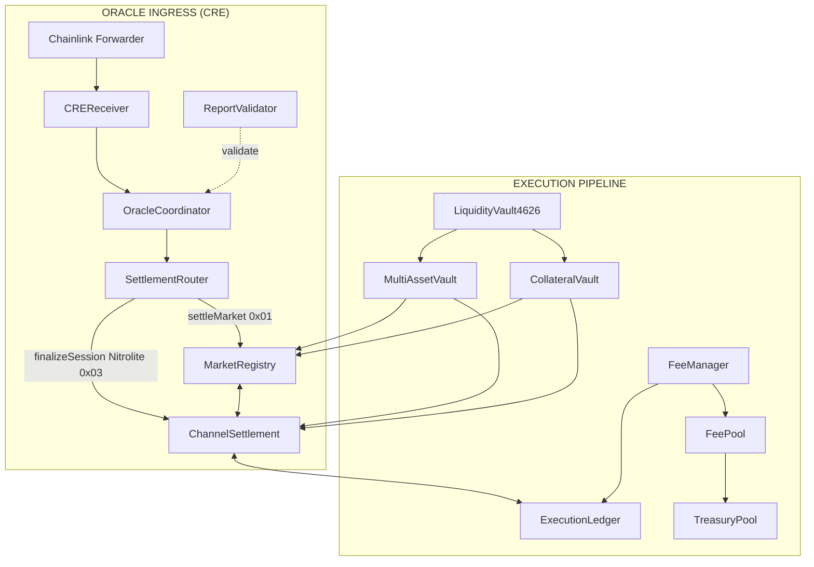
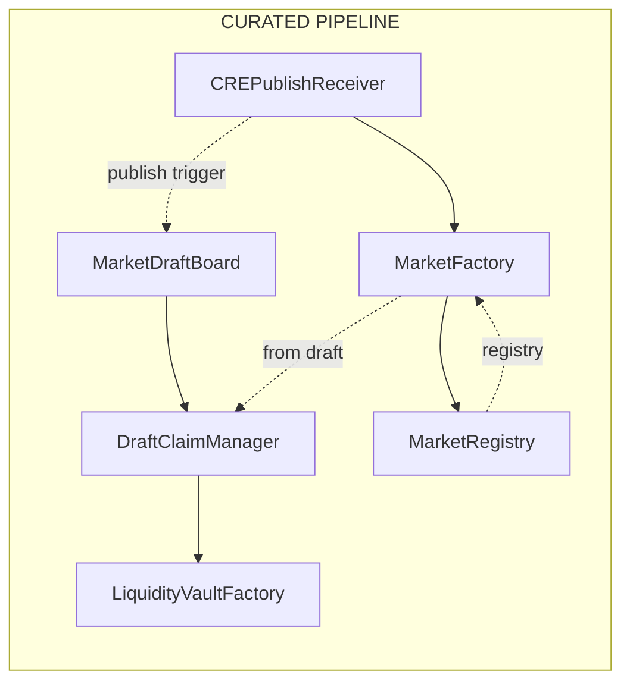
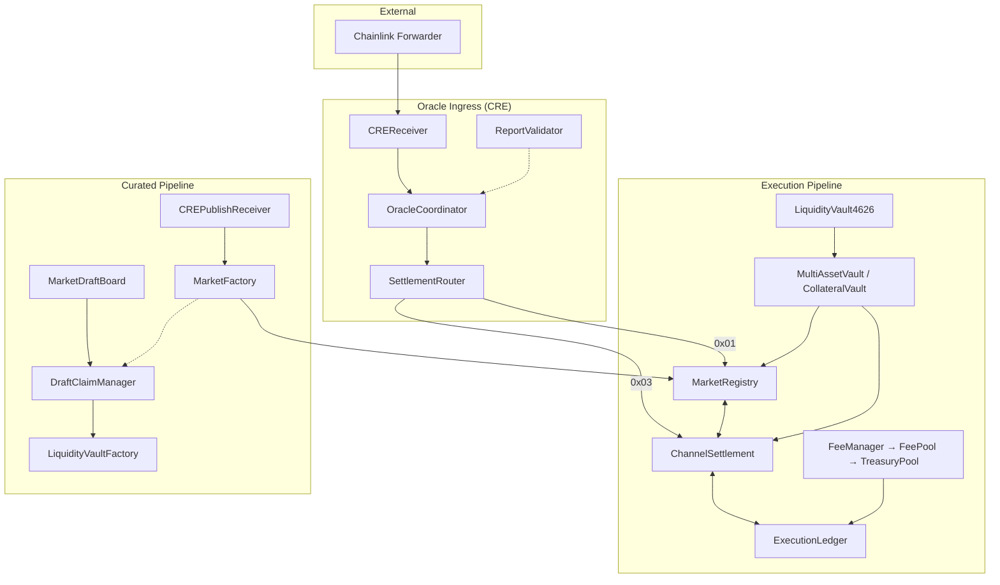

# RetroPick — Smart Contract Protocol

**Modular prediction-market settlement and publishing system.** On-chain custody, settlement, and fees with off-chain orchestration via Chainlink CRE workflows.

[](https://soliditylang.org/)
[](https://getfoundry.sh/)
[](https://testnet.snowscan.xyz)

---

## Executive Summary

RetroPick is a production-ready prediction market protocol that separates **on-chain primitives** (custody, settlement, fees, registry, publishing) from **off-chain orchestration** (draft proposals, publishing triggers, resolution data). All oracle flows enter through **Chainlink CRE** (Chainlink Request-and-Execute), ensuring a single trusted entry point for resolution and checkpoint settlement.

| Aspect | Description |
|--------|-------------|
| **Core flow** | Curated drafts → Claim & seed → Publish via CRE → Off-chain trading (Nitrolite Yellow) → Checkpoint settlement → Oracle resolution → Redeem |
| **Trading model** | Off-chain state channels (Yellow sessions) with LS-LMSR pricing; on-chain checkpoint settlement with operator + user signatures |
| **Oracle** | Chainlink Forwarder → CREReceiver → OracleCoordinator → SettlementRouter → MarketRegistry / ChannelSettlement |
| **Deployed** | Avalanche Fuji (43113); 17 verified contracts on Snowscan |
| **Framework** | Foundry; Solidity 0.8.24; OpenZeppelin |

---

## Key Differentiators

| Differentiator | Description |
|----------------|-------------|
| **Chainlink CRE-native** | All oracle and settlement flows enter via Chainlink Forwarder; single trusted entry point |
| **Modular architecture** | Custody, settlement, fees, and curation are separate contracts; upgradeable wiring |
| **Off-chain trading, on-chain custody** | Nitrolite Yellow state channels for gasless trading; on-chain checkpoints for finality |
| **Curated supply** | AI-proposed drafts → creator claim & seed → CRE publish; quality gate at market creation |
| **ERC-4626 LP vaults** | Per-market liquidity vaults; protocol/LP/creator fee split with treasury fallback |
| **Production-deployed** | 17 verified contracts on Avalanche Fuji; full E2E test suite mirrors deployment |

---

## Architecture Overview

### Oracle Ingress (CRE) → Execution Pipeline



### Curated Pipeline



### Layered View (all pipelines)



### Three Production Lanes

1. **Curated publish** — AI proposes drafts → Creator claims and seeds → CRE publish → Market created with bound LP vault  
2. **Oracle resolution** — CRE sends outcome reports → CREReceiver → OracleCoordinator → SettlementRouter → MarketRegistry  
3. **Nitrolite Yellow checkpoint** — Relayer builds signed checkpoints → CRE sends `0x03` session payload → ChannelSettlement  

---

## Contract Inventory

**17 production contracts** deployed by `DeployTestnet.s.sol`:

### Execution Lane (Custody + Settlement)

| Contract | Role |
|----------|------|
| **ExecutionLedger** | Per-(market, user, outcome) share positions |
| **ChannelSettlement** | Nitrolite Yellow checkpoint verification, operator/user signatures, LP counterparty |
| **MultiAssetVault** | Per-asset custody for cash deltas |
| **CollateralVault** | Single-token fallback; MarketRegistry VAULT for redeem path |
| **SettlementRouter** | Routes outcome reports and session payloads |
| **MarketRegistry** | Market metadata, resolution, redeem from ledger + vault |

### Fees

| Contract | Role |
|----------|------|
| **FeeManager** | Protocol/LP/creator fee split (bps) |
| **FeePool** | Protocol fee collection |
| **TreasuryPool** | LP fee fallback when vault has zero supply |

### Oracle + Routing (CRE Integration)

| Contract | Role |
|----------|------|
| **ReportValidator** | Minimum confidence threshold for resolution reports |
| **CREReceiver** | CRE entrypoint; routes outcome (0x01) and session (0x03) reports |
| **OracleCoordinator** | Validates confidence, forwards to SettlementRouter |
| **SettlementRouter** | Routes to MarketRegistry (settle) or ChannelSettlement (session) |

### Curation / Publishing

| Contract | Role |
|----------|------|
| **MarketPolicy** | Policy checks (e.g. min creator seed) |
| **MarketDraftBoard** | Draft lifecycle: Proposed → Claimed → Published |
| **DraftClaimManager** | claimDraft / claimAndSeed; custody of locked seed shares |
| **LiquidityVaultFactory** | Per-draft ERC-4626 vault deployment |
| **MarketFactory** | createFromDraft; binds liquidity vault to market |
| **CREPublishReceiver** | CRE entrypoint for publish-from-draft reports |

---

## Avalanche Fuji Deployment (43113)

| Parameter | Value |
|-----------|-------|
| **Chain** | Avalanche Fuji (C-Chain) |
| **Chain ID** | 43113 |
| **Explorer** | [testnet.snowscan.xyz](https://testnet.snowscan.xyz) |
| **Deployer** | `0x38A8AB6EE17EB531d86eb877e56005587bC078e7` |
| **Compiler** | v0.8.24+commit.e11b9ed9 |
| **RPC** | `https://avalanche-fuji.infura.io/v3/...` |

### Verified Contract Addresses (Snowscan)

#### Active: DeployBetaTestnet (current deployment)

Script: `DeployBetaTestnet.s.sol` — Mock tokens, Faucet, V3-Escrow. Use for beta testers and relayer.

| Contract              | Address |
| --------------------- | ------- |
| MockUSDC (settlement) | [0x61c8d94ab8a729126a9FA41751FaD7F464604948](https://testnet.snowtrace.io/address/0x61c8d94ab8a729126a9FA41751FaD7F464604948/contract/43113/code?chainid=43113) |
| MockDAI               | [0xfefF1c0df050cDcD7dD6988749654A3a8948d746](https://testnet.snowtrace.io/address/0xfefF1c0df050cDcD7dD6988749654A3a8948d746/contract/43113/code?chainid=43113) |
| MockUSDT              | [0xEcED85042Cbbb7756E0809e51aDf7B7a8d2851Aa](https://testnet.snowtrace.io/address/0xEcED85042Cbbb7756E0809e51aDf7B7a8d2851Aa/contract/43113/code?chainid=43113) |
| MockEURC              | [0x08f7a4CFba8E8c944D33630faA2032b3B3b7c5e1](https://testnet.snowtrace.io/address/0x08f7a4CFba8E8c944D33630faA2032b3B3b7c5e1/contract/43113/code?chainid=43113) |
| MockAVAX              | [0x8CA51cb13B91A6530429f154B8505c40BE0d7908](https://testnet.snowtrace.io/address/0x8CA51cb13B91A6530429f154B8505c40BE0d7908/contract/43113/code?chainid=43113) |
| MockIDRX              | [0x952877CD34812E316CfE2324A632ad5c71d096EA](https://testnet.snowtrace.io/address/0x952877CD34812E316CfE2324A632ad5c71d096EA/contract/43113/code?chainid=43113) |
| Faucet                | [0x4d74eCEc809D1DbbD8D4B9D1c26fFc8b8FbA9E89](https://testnet.snowtrace.io/address/0x4d74eCEc809D1DbbD8D4B9D1c26fFc8b8FbA9E89/contract/43113/code?chainid=43113) |
| OutcomeToken1155     | [0x9B413811ecfD0e0679A7Ba785de44E15E7482044](https://testnet.snowtrace.io/address/0x9B413811ecfD0e0679A7Ba785de44E15E7482044/contract/43113/code?chainid=43113) |
| MarketRiskManager     | [0x9DB5b69A6EdCC433e56C3C96e770A737a4b13555](https://testnet.snowtrace.io/address/0x9DB5b69A6EdCC433e56C3C96e770A737a4b13555/contract/43113/code?chainid=43113) |
| ChannelSettlement     | [0xFA5D0e64B0B21374690345d4A88a9748C7E22182](https://testnet.snowtrace.io/address/0xFA5D0e64B0B21374690345d4A88a9748C7E22182/contract/43113/code?chainid=43113) |
| MultiAssetVault       | [0x71EEA55f90c028aEE2b0F0785d015ea4e9165aBF](https://testnet.snowtrace.io/address/0x71EEA55f90c028aEE2b0F0785d015ea4e9165aBF/contract/43113/code?chainid=43113) |
| CollateralVault       | [0x792a065dD308A1Fc3d115Ea006b3093D8fBd7ea1](https://testnet.snowtrace.io/address/0x792a065dD308A1Fc3d115Ea006b3093D8fBd7ea1/contract/43113/code?chainid=43113) |
| MarketRegistry        | [0x3235094A8826a6205F0A0b74E2370A4AC39c6Cc2](https://testnet.snowtrace.io/address/0x3235094A8826a6205F0A0b74E2370A4AC39c6Cc2/contract/43113/code?chainid=43113) |
| FeeManager            | [0x40094a387A609b5B983CD7eC8Ce3Ac44Ccbca1Db](https://testnet.snowtrace.io/address/0x40094a387A609b5B983CD7eC8Ce3Ac44Ccbca1Db/contract/43113/code?chainid=43113) |
| FeePool               | [0xB0d262089Cd5F66239298eb462D878fC50CBD2f3](https://testnet.snowtrace.io/address/0xB0d262089Cd5F66239298eb462D878fC50CBD2f3/contract/43113/code?chainid=43113) |
| TreasuryPool          | [0x504313Da50e3E3d42769B96A16B9F58C2B84348a](https://testnet.snowtrace.io/address/0x504313Da50e3E3d42769B96A16B9F58C2B84348a/contract/43113/code?chainid=43113) |
| ReportValidator       | [0x45Ac2A2473675D7baA7b24E07dc9A4053b005282](https://testnet.snowtrace.io/address/0x45Ac2A2473675D7baA7b24E07dc9A4053b005282/contract/43113/code?chainid=43113) |
| CREReceiver           | [0x51c0680d8E9fFE2A2f6CC65e598280D617D6cAb7](https://testnet.snowtrace.io/address/0x51c0680d8E9fFE2A2f6CC65e598280D617D6cAb7/contract/43113/code?chainid=43113) |
| OracleCoordinator     | [0x101053889dE4748763AA337685aA6842D3D4723C](https://testnet.snowtrace.io/address/0x101053889dE4748763AA337685aA6842D3D4723C/contract/43113/code?chainid=43113) |
| SettlementRouter      | [0xBfE28C2740C4b9Ee87299EF0a6590b21C0EBa4d0](https://testnet.snowtrace.io/address/0xBfE28C2740C4b9Ee87299EF0a6590b21C0EBa4d0/contract/43113/code?chainid=43113) |
| MarketPolicy          | [0x041584444a592d9c9Dbd7D1EDc110D63643408b5](https://testnet.snowtrace.io/address/0x041584444a592d9c9Dbd7D1EDc110D63643408b5/contract/43113/code?chainid=43113) |
| MarketDraftBoard      | [0x8a81759d0A4383E4879b0Ff298Bf60ff24be8302](https://testnet.snowtrace.io/address/0x8a81759d0A4383E4879b0Ff298Bf60ff24be8302/contract/43113/code?chainid=43113) |
| DraftClaimManager     | [0x0b7B98b10b2067a4918720Bc04f374c669B313d5](https://testnet.snowtrace.io/address/0x0b7B98b10b2067a4918720Bc04f374c669B313d5/contract/43113/code?chainid=43113) |
| LiquidityVaultFactory | [0x714518B11a4ce31C4fE42F0155473FD5158AD84e](https://testnet.snowtrace.io/address/0x714518B11a4ce31C4fE42F0155473FD5158AD84e/contract/43113/code?chainid=43113) |
| CREPublishReceiver    | [0x3AA7E5A28A72Df248806397Ea16C03fB10c46830](https://testnet.snowtrace.io/address/0x3AA7E5A28A72Df248806397Ea16C03fB10c46830/contract/43113/code?chainid=43113) |
| MarketFactory         | [0x2f70602034854C14CBfD1F94C713f833d344d748](https://testnet.snowtrace.io/address/0x2f70602034854C14CBfD1F94C713f833d344d748/contract/43113/code?chainid=43113) |

**Relayer:** `CHANNEL_SETTLEMENT_ADDRESS=0xFA5D0e64B0B21374690345d4A88a9748C7E22182`

---

#### Legacy: DeployTestnet (earlier deployment)

Script: `DeployTestnet.s.sol` — Real Fuji USDC, ExecutionLedger. Different addresses from above.

| Contract              | Address |
| --------------------- | ------- |
| ExecutionLedger       | [0xE4d4187d6Ca2c4eA36A05d3eb61a7A79da7F6D25](https://testnet.snowtrace.io/address/0xE4d4187d6Ca2c4eA36A05d3eb61a7A79da7F6D25/contract/43113/code?chainid=43113) |
| ChannelSettlement     | [0xa1F7673D2677FB9e48C7a6295DD7cF44F8c0A212](https://testnet.snowtrace.io/address/0xa1F7673D2677FB9e48C7a6295DD7cF44F8c0A212/contract/43113/code?chainid=43113) |
| CREReceiver           | [0xf427BC9e8C7004F394fa06147bf42aad1D516FdF](https://testnet.snowtrace.io/address/0xf427BC9e8C7004F394fa06147bf42aad1D516FdF/contract/43113/code?chainid=43113) |
| MarketRegistry        | [0xdB8d890B9aE6A40D2838A508F7D2126cb42a36E4](https://testnet.snowtrace.io/address/0xdB8d890B9aE6A40D2838A508F7D2126cb42a36E4/contract/43113/code?chainid=43113) |
| MarketFactory         | [0x68D0e961FdFAF031323099a4680847321eFBb7e5](https://testnet.snowtrace.io/address/0x68D0e961FdFAF031323099a4680847321eFBb7e5/contract/43113/code?chainid=43113) |
| MultiAssetVault       | [0xf780caB68DE9800fd6b8ee6AEfc0b06A5F3181dB](https://testnet.snowtrace.io/address/0xf780caB68DE9800fd6b8ee6AEfc0b06A5F3181dB/contract/43113/code?chainid=43113) |
| CollateralVault       | [0xe1557c8f239752A22278a5c55f0CB28b041D9fcd](https://testnet.snowtrace.io/address/0xe1557c8f239752A22278a5c55f0CB28b041D9fcd/contract/43113/code?chainid=43113) |
| SettlementRouter      | [0x789daEE98ac0C8EEe220Dd768f0e2A05C66B983E](https://testnet.snowtrace.io/address/0x789daEE98ac0C8EEe220Dd768f0e2A05C66B983E/contract/43113/code?chainid=43113) |
| FeeManager            | [0xB9C04B35C64dc263809DaeA3233de0855b44a82D](https://testnet.snowtrace.io/address/0xB9C04B35C64dc263809DaeA3233de0855b44a82D/contract/43113/code?chainid=43113) |
| FeePool               | [0x59d2B7563bC7b80c3EcE9A3E616441e68ca158A6](https://testnet.snowtrace.io/address/0x59d2B7563bC7b80c3EcE9A3E616441e68ca158A6/contract/43113/code?chainid=43113) |
| TreasuryPool          | [0x1723701b8143537e023b9C6165dAeF9A67125d43](https://testnet.snowtrace.io/address/0x1723701b8143537e023b9C6165dAeF9A67125d43/contract/43113/code?chainid=43113) |
| ReportValidator       | [0xC6c31b73CE71B42aB45dd017061fcd5D9620a1bE](https://testnet.snowtrace.io/address/0xC6c31b73CE71B42aB45dd017061fcd5D9620a1bE/contract/43113/code?chainid=43113) |
| OracleCoordinator     | [0xA30Fa013c5CAe93C2e75129ceA669635e011d6F8](https://testnet.snowtrace.io/address/0xA30Fa013c5CAe93C2e75129ceA669635e011d6F8/contract/43113/code?chainid=43113) |
| MarketPolicy          | [0x98f399081CbDB2eeB66c8c3c51F5fF592A045396](https://testnet.snowtrace.io/address/0x98f399081CbDB2eeB66c8c3c51F5fF592A045396/contract/43113/code?chainid=43113) |
| MarketDraftBoard      | [0xa1A31B61748252D7E1f15B2F74de0ce99f1a296f](https://testnet.snowtrace.io/address/0xa1A31B61748252D7E1f15B2F74de0ce99f1a296f/contract/43113/code?chainid=43113) |
| DraftClaimManager     | [0x1Ccccc54e0cE928b3FC04aA2Ed4E012E7EaAdDe9](https://testnet.snowtrace.io/address/0x1Ccccc54e0cE928b3FC04aA2Ed4E012E7EaAdDe9/contract/43113/code?chainid=43113) |
| LiquidityVaultFactory | [0xd895dD8547A0fC6214A7ce9D74B49F9b0601C362](https://testnet.snowtrace.io/address/0xd895dD8547A0fC6214A7ce9D74B49F9b0601C362/contract/43113/code?chainid=43113) |
| CREPublishReceiver    | [0xEF0aebe656c82A6d070f904c0c31EE1B0B81fBB2](https://testnet.snowtrace.io/address/0xEF0aebe656c82A6d070f904c0c31EE1B0B81fBB2/contract/43113/code?chainid=43113) |

### Deployment Parameters (Fuji)

| Parameter | Value |
|-----------|-------|
| SETTLEMENT_TOKEN (USDC) | `0x5425890298aed601595a70AB815c96711a31Bc65` |
| CHAINLINK_FORWARDER | `0x2e7371a5d032489e4f60216d8d898a4c10805963` |
| MIN_CONFIDENCE | 8000 (80%) |
| PROTOCOL_FEE_BPS | 200 (2%) |
| LP_FEE_SHARE_BPS | 2000 (20%) |
| CREATOR_FEE_SHARE_BPS | 2000 (20%) |

---

## Tech Stack

| Component | Technology |
|-----------|------------|
| **Framework** | Foundry (forge, cast, anvil) |
| **Solidity** | 0.8.24 |
| **Dependencies** | OpenZeppelin Contracts |
| **Compiler** | via_ir, optimizer_runs=200 (EIP-170 compliance) |
| **Networks** | Avalanche Fuji, Base Sepolia |

---

## Getting Started

### Prerequisites

- [Foundry](https://getfoundry.sh/): `curl -L https://foundry.paradigm.xyz | bash && foundryup`

### Build

```bash
forge build
```

### Test

```bash
# Full suite
forge test

# E2E tests (production path)
forge test --match-contract E2EDeployTestnetTest

# With verbosity
forge test -vvv
```

### Deploy (Production)

**DeployTestnet** (production-style, real Fuji USDC):

```bash
# Copy and configure environment
cp .env.example .env.fuji  # or use scripts/env/.env.fuji
# Required: OPERATOR, SETTLEMENT_TOKEN, CHAINLINK_FORWARDER
# Required: MIN_CONFIDENCE, PROTOCOL_FEE_BPS, LP_FEE_SHARE_BPS, CREATOR_FEE_SHARE_BPS

forge script script/DeployTestnet.s.sol:DeployTestnet \
  --rpc-url $RPC_URL \
  --broadcast \
  --private-key $PRIVATE_KEY
```

**DeployBetaTestnet** (beta testers, mock tokens + Faucet):

```bash
source scripts/env/.env.fuji
# Required: OPERATOR, CHAINLINK_FORWARDER, MIN_CONFIDENCE, fee bps
# No SETTLEMENT_TOKEN — uses mock USDC

forge script script/DeployBetaTestnet.s.sol:DeployBetaTestnet \
  --rpc-url $RPC_URL \
  --broadcast \
  --private-key $PRIVATE_KEY
```

### Verify on Snowscan (Fuji)

**DeployTestnet** (hardcoded addresses):

```bash
source scripts/env/.env.fuji  # or .env.fuji at root
chmod +x scripts/verify_fuji_snowtrace_stable.sh
RETRIES=10 SLEEP=12 WATCH=1 scripts/verify_fuji_snowtrace_stable.sh
```

**DeployBetaTestnet** or generic broadcast-based:

```bash
source scripts/env/.env.fuji
chmod +x scripts/verify_beta_fuji.sh
WATCH=0 scripts/verify_beta_fuji.sh

# Verify all 24 contracts + export ABIs to docs/abi/:
./scripts/verify_and_export_abis_fuji.sh

# Or ABI export only (no verification):
./scripts/export_abis_to_docs.sh

# Or use godmode for any broadcast:
BROADCAST_FILE=broadcast/DeployBetaTestnet.s.sol/43113/run-latest.json scripts/verify_fuji_godmode.sh
```

---

## Production Flows

### 1. Curated Draft → Publish

```
Propose draft (AI_ORACLE_ROLE) → claimAndSeed (creator EIP-712) → 
CREPublishReceiver.onReport → MarketFactory.createFromDraft → 
MarketRegistry + setLiquidityVault → markPublished
```

- **Draft** must have `settlementAsset` and `minSeed`
- **claimAndSeed** locks seed shares in DraftClaimManager until `tradingClose`
- **Publish** requires creator signature; CRE workflow sends report via Forwarder

### 2. Nitrolite Yellow Checkpoint

```
Off-chain trading (relayer) → Build checkpoint + deltas → Operator + user signatures →
CRE workflow fetches payload → CREReceiver.onReport(0x03 || payload) →
OracleCoordinator.submitSession → SettlementRouter.finalizeSession →
ChannelSettlement.submitCheckpointFromPayload → 30min challenge window →
finalizeCheckpoint → ExecutionLedger + MultiAssetVault + FeeManager
```

- Relayer config: `CHANNEL_SETTLEMENT_ADDRESS`, `OPERATOR_PRIVATE_KEY`
- Checkpoint: `(marketId, sessionId, nonce, stateHash, deltasHash)` + `Delta[]`
- Delta: `(user, outcomeIndex, sharesDelta, cashDelta)`

### 3. Oracle Resolution → Redeem

```
CRE outcome report → CREReceiver.onReport → OracleCoordinator.submitResult →
ReportValidator.validate(confidence) → SettlementRouter.settleMarket →
MarketRegistry.onReport(0x01 || ...) → _doResolve(marketId, outcomeIndex, confidence)
```

- User calls `MarketRegistry.redeem(marketId)` when resolved
- Payout from MultiAssetVault or CollateralVault; one-shot per (marketId, user)

---

## Security & Trust Model

### Access Control

| Boundary | Enforcement |
|----------|-------------|
| **Forwarder** | CREReceiver, CREPublishReceiver, MarketFactory: only Forwarder can call `onReport` |
| **Coordinator** | OracleCoordinator: only CREReceiver can call `submitResult` / `submitSession` |
| **Router** | SettlementRouter: only OracleCoordinator can call `settleMarket` / `finalizeSession` |
| **Resolver** | MarketRegistry: only SettlementRouter can call `resolve` / `onReport` |
| **Checkpoint** | ChannelSettlement: operator + every delta user must sign; nonce monotonicity; challenge window |
| **Publish** | MarketFactory: only approved publish receivers; creator EIP-712 signature |

### Invariants

- Every delta user must sign the checkpoint
- Nonce strictly increasing; replay protection
- `lastTradeAt <= tradingClose` at finalize
- Total fee bps capped (2%)
- Seed shares custody-locked until `tradingClose`

### Test Coverage

- `SecurityHardening.t.sol` — unsigned delta, unauthorized resolve, post-close trade
- `CheckpointFlow.t.sol` — hash mismatch, bad sigs, nonce, challenge window
- `CurationFlow.t.sol` — seeded publish, draft-time mismatch, share lock custody
- `InvariantSolvency.t.sol` — LP vault requirement, settlement solvency
- `E2EDeployTestnet.t.sol` — full production path end-to-end

---

## Documentation

| Document | Description |
|----------|-------------|
| [`.docs/deployment/deploymentAvalancheFuji.md`](.docs/deployment/deploymentAvalancheFuji.md) | Fuji deployment, addresses, parameters |
| [`.docs/e2e/CurrentSmartContract.md`](.docs/e2e/CurrentSmartContract.md) | Full architecture, flows, trust model, data structures |
| [`.docs/e2e/e2eAvalanceFujiTest.md`](.docs/e2e/e2eAvalanceFujiTest.md) | E2E tests, Nitrolite Yellow, wiring |
| [`.docs/e2e/Frontend.md`](.docs/e2e/Frontend.md) | Frontend integration, contract-to-feature mapping, EIP-712 |

---

## Project Status

| Component | Status |
|-----------|--------|
| Execution lane (MarketRegistry, ChannelSettlement, ExecutionLedger, vaults) | ✅ Production |
| Oracle + routing (CREReceiver, OracleCoordinator, SettlementRouter) | ✅ Production |
| Curated pipeline (DraftBoard, DraftClaimManager, CREPublishReceiver, MarketFactory) | ✅ Production |
| Fee split (protocol/LP/creator) | ✅ Production |
| Nitrolite Yellow checkpoint settlement | ✅ Production |
| Avalanche Fuji deployment | ✅ Verified |
| E2E test suite | ✅ 46+ tests passing |
| Formal audit | ⏳ Pending |

---

## Relayer Integration (Nitrolite Yellow)

Set in `apps/relayer/.env`:

| Variable | Purpose |
|----------|---------|
| `CHANNEL_SETTLEMENT_ADDRESS` | ChannelSettlement contract (Nitrolite Yellow on-chain target) |
| `OPERATOR_PRIVATE_KEY` | Key for checkpoint signing (must match OPERATOR) |

Relayer exposes `GET /cre/checkpoints/:sessionId` and `POST /cre/checkpoints/:sessionId`; CRE workflow fetches payloads and sends `0x03` reports to CREReceiver.

---

## License

MIT
