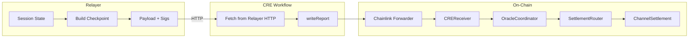

# Chainlink CRE Integration Overview

**Last updated:** 2026-02-20  
**Context:** [CurrentSmartContract.md](../CurrentSmartContract.md) | [e2eAvalanceFujiTest.md](../../../e2e/e2eAvalanceFujiTest.md)

---

## 1. What Is CRE?

**CRE (Chainlink Runtime Environment)** is Chainlink's orchestration layer for building institutional-grade smart contracts that are data-connected and interoperable across blockchains. Introduced in 2024, it evolved from the Request-and-Execute pattern into a full workflow platform.

### 1.1 Core Concepts

| Concept | Description |
|---------|-------------|
| **Workflow** | Compiled WebAssembly (WASM) binary built with Go or TypeScript SDK; runs on a Decentralized Oracle Network (DON) |
| **Trigger** | Event that starts execution: cron, HTTP, EVM log, etc. |
| **Callback** | Business logic function; invokes capabilities (HTTP fetch, chain read/write) |
| **Capability** | Decentralized microservice: chain read/write, HTTP fetch, computation |
| **Consensus** | Every capability runs across multiple nodes; BFT protocol produces a single verified result |
| **Forwarder** | On-chain contract that receives workflow reports and delivers them to receiver contracts |

### 1.2 Why RetroPick Uses CRE

RetroPick uses CRE as the **single trusted entry point** for all oracle flows:

1. **Outcome resolution** — Oracle reports market results; CRE delivers via Forwarder.
2. **Checkpoint settlement** — Relayer builds signed checkpoints; CRE fetches and delivers to `ChannelSettlement`.
3. **Market publish** — `CREPublishReceiver` receives publish-from-draft reports via Forwarder.

Key properties:

- **Forwarder-only ingress**: Only the Chainlink Forwarder can call `onReport` on CRE receivers.
- **Unified trust model**: All oracle and settlement flows enter through CRE receivers.
- **Separation of concerns**: Relayer prepares data; CRE workflow fetches and delivers; Forwarder executes on-chain.
- **Built-in consensus**: API fetches and chain writes run across DON nodes with BFT verification.

---

## 2. Report Types and Routing

### 2.1 CREReceiver (Oracle Ingress)

`CREReceiver` receives reports from the Forwarder and routes by report prefix:

| Report Prefix | Type | Action |
|---------------|------|--------|
| `0x03` | Session (Nitrolite Yellow checkpoint) | `oracleCoordinator.submitSession(report[1:])` → `SettlementRouter.finalizeSession` → `ChannelSettlement.submitCheckpointFromPayload` |
| (none) | Outcome | `abi.decode(report, ...)` → `oracleCoordinator.submitResult(market, marketId, outcomeIndex, confidence)` → `SettlementRouter.settleMarket` → `MarketRegistry.onReport(0x01...)` |

### 2.2 CREPublishReceiver (Separate Receiver)

`CREPublishReceiver` is a **separate** CRE receiver (different contract, same Forwarder). It handles publish-from-draft reports (schema `0x04`):

- Forwarder → `CREPublishReceiver.onReport` → `MarketFactory.createFromDraft`

See [CREReportFormats.md](CREReportFormats.md) for exact payload formats.

---

## 3. Why Relayer Does Not Call Contracts Directly

### 3.1 Access Control Chain

1. **CREReceiver** — `ReceiverTemplate` enforces `msg.sender == forwarderAddress`. A relayer calling `onReport` would revert with `InvalidSender`.

2. **SettlementRouter.finalizeSession** — `onlyOracleCoordinator`; only `OracleCoordinator` can call it.

3. **OracleCoordinator.submitSession** — `onlyReceiver`; only `CREReceiver` can call it.

So the intended path is: **CRE (via Forwarder) → CREReceiver → OracleCoordinator → SettlementRouter → ChannelSettlement**.

### 3.2 Design Rationale

- **Single trusted entry point**: All flows enter via CRE receivers.
- **Chainlink integration**: CRE workflows handle triggers, fetch from relayer, use `writeReport`.
- **Separation**: Relayer = session state, signatures, API; CRE = orchestration and on-chain writes.
- **Consistency**: Outcome resolution and checkpoint settlement use the same CRE path.

---

## 4. CRE Pipeline Diagram

---

## 5. CRE Workflow Architecture (Deep Dive)

### 5.1 Trigger-and-Callback Model

CRE workflows use a **trigger-and-callback** pattern:

1. **Trigger** — Fires when an event occurs (e.g. cron every 10 min, HTTP POST, EVM log).
2. **Callback** — Runs when trigger fires; creates SDK clients, invokes capabilities, returns.
3. **Handler** — Connects a trigger to a callback: `cre.Handler(cron.Trigger(...), onCronTrigger)`.

### 5.2 Execution Lifecycle

When a trigger fires:

1. Each node in the Workflow DON independently runs the callback.
2. Capability calls (HTTP, chain read/write) are async; multiple can run in parallel.
3. A dedicated Capability DON executes each operation; results are consensus-verified.
4. Final step: `evmClient.writeReport(payload)` sends the report on-chain.
5. The Chainlink Forwarder receives it and forwards to the configured receiver.

### 5.3 Why Relayer → CRE → Forwarder (Not Direct)

| Path | Who calls | Result |
|------|-----------|--------|
| Relayer → CREReceiver | Relayer's HTTP client | `InvalidSender` revert (msg.sender ≠ Forwarder) |
| CRE → Forwarder → CREReceiver | Forwarder (as tx executor) | Succeeds; CRE workflow is authorized via DON |

The Forwarder is the **only** contract that can call `onReport`. CRE workflows run on Chainlink infrastructure; the Forwarder trusts DON-signed reports and delivers them to receivers.

### 5.4 RetroPick CRE Integration Points

| Flow | Trigger (typical) | CRE fetches from | Writes to |
|------|-------------------|------------------|-----------|
| **Checkpoint** | Cron (e.g. every 5 min) | `GET/POST relayerUrl/cre/checkpoints/:sessionId` | `evmClient.writeReport(0x03\|\|payload)` → CREReceiver |
| **Outcome** | Cron or external | Oracle data source | `evmClient.writeReport(abi.encode(...))` → CREReceiver |
| **Publish** | HTTP (creator requests) | — | `evmClient.writeReport(0x04\|\|...)` → CREPublishReceiver |

---

## 6. References

- [Chainlink CRE Documentation](https://docs.chain.link/cre) — Official docs
- [CREReceiver.sol](../../../src/oracle/CREReceiver.sol) — `_processReport` (lines 31–41)
- [CREReportFormats.md](CREReportFormats.md) — Payload schemas
- [CREWorkflowIntegration.md](CREWorkflowIntegration.md) — Workflow setup, endpoints, config
