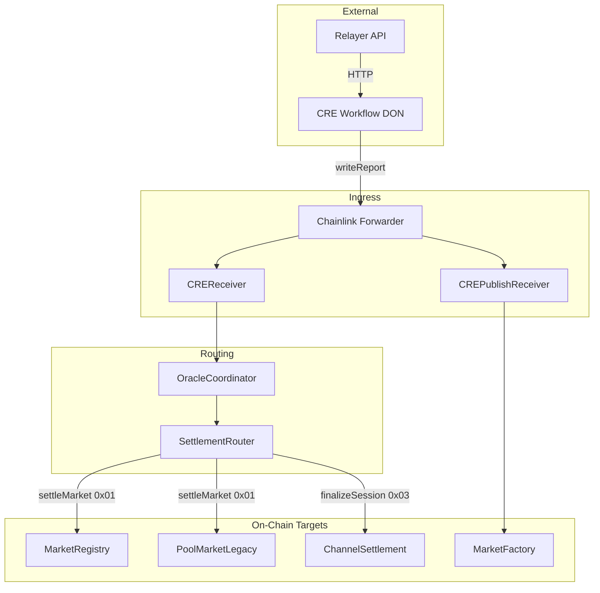
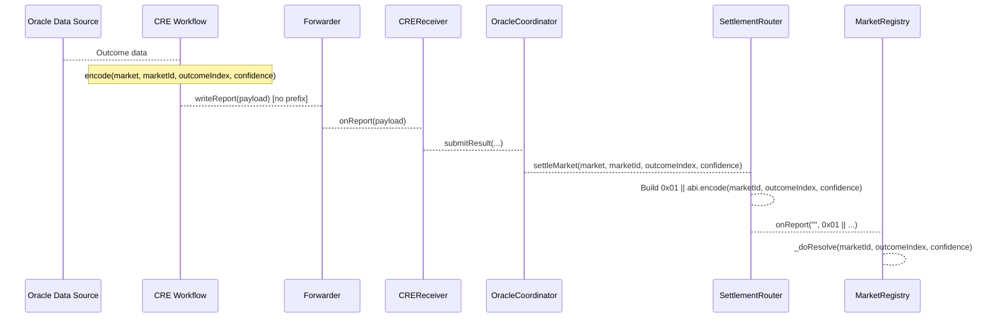
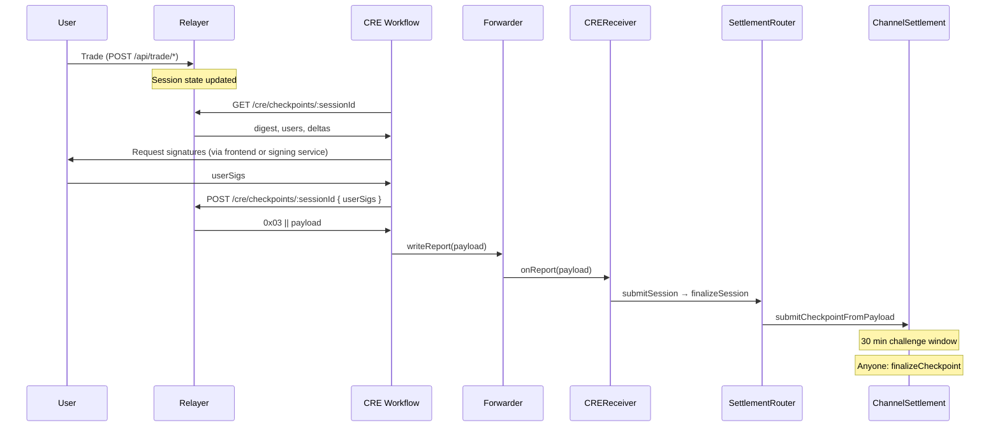
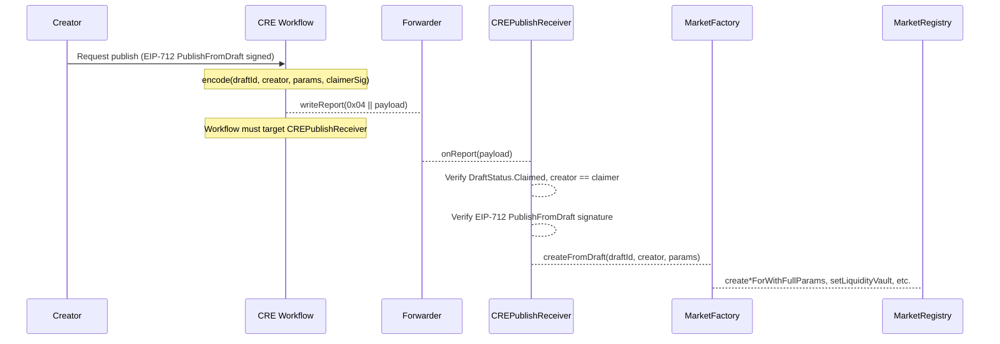

# CRE Pipeline Diagram

**Last updated:** 2026-03-01  
**Context:** [CREOverview.md](CREOverview.md) | [CurrentSmartContract.md](../CurrentSmartContract.md)  
**Source:** [CREReceiver.sol](../../../../src/oracle/CREReceiver.sol) lines 31–41, [SettlementRouter.sol](../../../../src/core/SettlementRouter.sol) lines 111–143

---

## 1. Full Pipeline Topology



---

## 2. Execution Lifecycle (Generic)

```
Trigger (cron/HTTP/EVM) → Callback runs on DON
  → Capability calls (HTTP fetch, chain read)
  → Consensus across DON nodes
  → evmClient.writeReport(payload)
  → Forwarder receives tx
  → Forwarder calls receiver.onReport(metadata, payload)
  → Receiver._processReport routes by prefix
  → Coordinator/Router dispatch to target contract
```

---

## 3. Outcome Flow (Market Resolution)



**Relayer endpoints used:** None (outcome flow does not use relayer).

---

## 4. Checkpoint Flow (Session Settlement)



**Relayer endpoints used:**

| Endpoint | Purpose |
|----------|---------|
| `GET /cre/checkpoints` | List sessions with pending checkpoints |
| `GET /cre/checkpoints/:sessionId` | Get digest, users, deltas for signature collection |
| `POST /cre/checkpoints/:sessionId` | Build full payload with operator + user sigs |

See [RelayerAPI.md](../relayer/RelayerAPI.md) for full API details.

---

## 5. Publish Flow (Create Market from Draft)



**Relayer endpoints used:** None (publish flow uses creator signature; workflow targets CREPublishReceiver).

---

## 6. Forwarder Routing

The Chainlink Forwarder delivers reports to a **receiver address**. Each CRE workflow is configured with:

- **Target chain** and **Forwarder contract address**
- **Receiver address** (CREReceiver or CREPublishReceiver)

| Flow | Workflow targets | Receiver |
|------|------------------|----------|
| Outcome | CREReceiver | CREReceiver |
| Checkpoint | CREReceiver | CREReceiver |
| Publish | CREPublishReceiver | CREPublishReceiver |

The report **prefix** (0x03, 0x04) is used by the receiver for internal routing, not by the Forwarder. The Forwarder delivers to whichever receiver the workflow is configured for.

---

## 7. References

- [CREOverview.md](CREOverview.md) — CRE concepts, trust model
- [CREReportFormats.md](CREReportFormats.md) — Payload schemas
- [CREContractReference.md](CREContractReference.md) — Contract methods and guards
- [RelayerArchitecture.md](../relayer/RelayerArchitecture.md) — Relayer role and lifecycle
