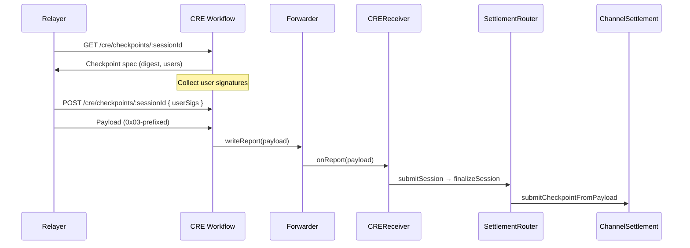

# CRE Workflow Integration

**Last updated:** 2026-02-20  
**Context:** [CREOverview.md](CREOverview.md) | [e2eAvalanceFujiTest.md](../../../e2e/e2eAvalanceFujiTest.md)

---

## 1. How Chainlink CRE Fits

The CRE workflow orchestrates off-chain execution and on-chain delivery:

1. **Triggers** — Cron (e.g. every 5–10 min), HTTP request, or EVM log starts the workflow.
2. **Fetch** — Workflow HTTP-fetches data from the relayer (e.g. `GET /cre/checkpoints/:sessionId`, `POST /cre/checkpoints/:sessionId`).
3. **Consensus** — Each capability (HTTP fetch, chain write) runs across DON nodes; BFT consensus produces a single verified result.
4. **Sign & Send** — Uses Chainlink `evmClient.writeReport(payload)` to send a transaction.
5. **Delivery** — Transaction is routed through the Chainlink Forwarder and calls `CREReceiver.onReport()` or `CREPublishReceiver.onReport()`.

The relayer **never** sends on-chain transactions; it only exposes HTTP APIs. The CRE workflow is responsible for fetching and delivering.

### 1.1 evmClient.writeReport

The EVM capability in CRE provides `writeReport(payload)`, which:

- Signs the payload with DON keys
- Sends a transaction to the Chainlink Forwarder
- Forwarder decodes and forwards to the configured receiver (`CREReceiver` or `CREPublishReceiver`)
- Receiver's `onReport(bytes report)` receives the payload; `report` may include a type prefix (e.g. `0x03` for session)

---

## 2. Flow: Nitrolite Yellow Checkpoint

---

## 3. Relayer Endpoints Used by CRE

| Method | Endpoint | Use |
|--------|----------|-----|
| GET | `/cre/sessions` | List sessions ready for finalization |
| GET | `/cre/sessions/:sessionId` | Legacy SessionFinalizer payload |
| GET | `/cre/checkpoints` | All checkpoint metadata |
| GET | `/cre/checkpoints/:sessionId` | Checkpoint spec (digest, users, chainId, channelSettlementAddress) |
| POST | `/cre/checkpoints/:sessionId` | Build full payload; body `{ userSigs: { [address]: "0x..." } }`; returns `0x03`-prefixed payload |

See [../relayer/RelayerAPI.md](../relayer/RelayerAPI.md) for full API details.

---

## 4. Environment and Configuration

### 4.1 On-Chain (Deployment)

| Variable | Description |
|----------|-------------|
| `CHAINLINK_FORWARDER` | Chainlink Forwarder contract address for the target chain |
| `OPERATOR` | Operator address (relayer checkpoint signer); used by ChannelSettlement |

### 4.2 Relayer

| Variable | Description |
|----------|-------------|
| `CHANNEL_SETTLEMENT_ADDRESS` | ChannelSettlement contract for Nitrolite Yellow path |
| `OPERATOR_PRIVATE_KEY` | Key used to sign checkpoints; must match ChannelSettlement.operator |
| `CHAIN_ID` | Chain ID for EIP-712 checkpoint signing |
| `RPC_URL` | RPC endpoint (optional, for NitroliteClient) |

### 4.3 CRE Workflow

| Variable | Description |
|----------|-------------|
| `relayerUrl` | Base URL of relayer API (e.g. `http://localhost:8790`) |
| Forwarder / receiver config | Workflow must be configured to target the correct Forwarder and receiver addresses |

---

## 5. Typical Checkpoint Flow

1. **CRE polls** `GET /cre/checkpoints` or similar to find sessions with pending checkpoints.
2. **CRE fetches** `GET /cre/checkpoints/:sessionId` to get digest and list of signing users.
3. **CRE collects** user signatures (via frontend or another service).
4. **CRE POSTs** `POST /cre/checkpoints/:sessionId` with `{ userSigs }` to get the full `0x03`-prefixed payload.
5. **CRE calls** `writeReport(payload)`; Forwarder delivers to `CREReceiver.onReport`.
6. **On-chain:** Checkpoint submitted; after 30 min challenge window, `finalizeCheckpoint` can be called.

---

## 6. Workflow Development Lifecycle

| Phase | Description |
|-------|-------------|
| **Simulate** | Compile workflow to WASM; run locally with real API/chain calls. No DON deployment. |
| **Deploy** | Upload workflow to CRE platform; request Early Access for DON deployment. |
| **Trigger** | Cron, HTTP, or event triggers fire; callback runs on DON. |
| **Monitor** | CRE UI provides logs, events, performance metrics. |

Simulation uses live relayer URLs and RPC endpoints, so you can validate the full path before deploying.

---

## 7. Checklist: CRE Workflow for Checkpoints

1. **Relayer running** — `CHANNEL_SETTLEMENT_ADDRESS`, `OPERATOR_PRIVATE_KEY`, `CHAIN_ID` set.
2. **Workflow trigger** — Cron (e.g. `0 */5 * * * *` every 5 min) or HTTP trigger.
3. **Callback logic** — `GET /cre/checkpoints` → for each session, `GET /cre/checkpoints/:sessionId` → collect `userSigs` (external) → `POST` → receive payload → `evmClient.writeReport(payload)`.
4. **Receiver config** — Workflow targets correct Forwarder and chain; CREReceiver address matches deployment.
5. **User signing** — Frontend or another service must collect user signatures and provide them to the workflow (or workflow fetches from a signing service).

---

## 8. References

- [Chainlink CRE Docs](https://docs.chain.link/cre) — Workflows, triggers, capabilities
- [creRoutes.ts](../../../../../../apps/relayer/src/api/creRoutes.ts) — Relayer CRE endpoints
- [buildCheckpointPayload.ts](../../../../../../apps/relayer/src/settlement/buildCheckpointPayload.ts) — Payload construction
- [e2eAvalanceFujiTest.md](../../../e2e/e2eAvalanceFujiTest.md) — Section 9.1 Nitrolite Yellow + Relayer Integration
