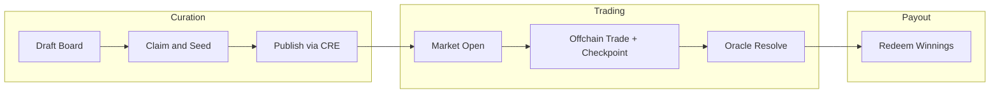
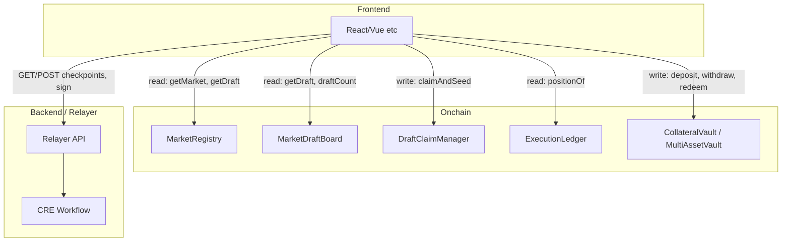
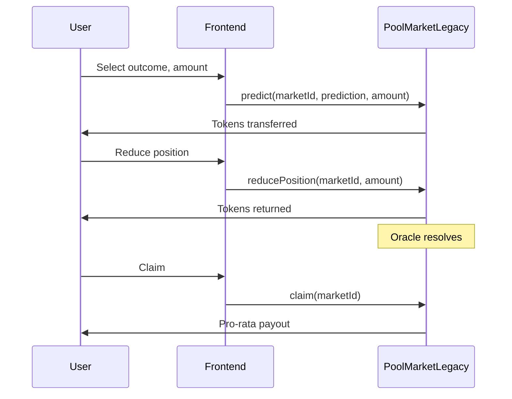

# RetroPick Application Flow

Last updated: 2026-02-20  
Audience: Frontend engineers  
Context: See [Frontend.md](Frontend.md) and [CurrentSmartContract.md](../CurrentSmartContract.md).

---

## 1. Overview

RetroPick has two production lanes. **For production UI, implement the Curated lane only.** The Legacy Pool lane is demo-only.

| Lane | Description | Frontend Priority |
|------|-------------|-------------------|
| **Curated** | AI proposes drafts → Creator claims & seeds → Publish via CRE → Trade (checkpoint) → Oracle resolves → Redeem | **Primary** |
| **Legacy Pool** | Direct onchain predict/reduce/claim; pool-based payouts | Demo only, not production |

---

## 2. Curated Path Flow

End-to-end sequence for the production lane:

### Steps

1. **Draft Board** — AI proposes market drafts; users browse and filter via `MarketDraftBoard`.
2. **Claim & Seed** — Creator claims draft, seeds liquidity (EIP-712 + token approve) via `DraftClaimManager.claimAndSeed`.
3. **Publish** — CRE workflow publishes draft to live market (backend-driven). Creator signs `PublishFromDraft` when relayer requests.
4. **Market Open** — Users deposit collateral to `CollateralVault` or `MultiAssetVault`, trade offchain via relayer.
5. **Checkpoint** — Operator collects signatures; users sign checkpoint digest; relayer submits via `ChannelSettlement`.
6. **Resolve** — Oracle delivers outcome via CRE; `MarketRegistry` marks market resolved.
7. **Redeem** — Winners call `MarketRegistry.redeem(marketId)` to claim payouts.

---

## 3. Component Interaction Diagram

---

## 4. User Flows by Role

### 4.1 Curator / Creator

| Step | Action | Contract / API |
|------|--------|----------------|
| 1 | Browse draft list | `MarketDraftBoard.draftCount`, `getDraftIdAt`, `getDraft` |
| 2 | Claim & seed draft | `DraftClaimManager.claimAndSeed` (EIP-712 sign first) |
| 3 | Publish (when relayer requests) | Sign `PublishFromDraft`; backend calls `CREPublishReceiver` → `MarketFactory.createFromDraft` |
| 4 | After `tradingClose` | `DraftClaimManager.unlockSeedShares(draftId)` |
| 5 | Monitor status | Subscribe to `DraftPublished`, `MarketCreated` |

### 4.2 Trader

| Step | Action | Contract / API |
|------|--------|----------------|
| 1 | Deposit collateral | `CollateralVault.deposit` or `MultiAssetVault.deposit` |
| 2 | Place order | Via relayer (offchain) |
| 3 | Sign checkpoint | Relayer `GET /cre/checkpoints/:sessionId` → user signs digest → `POST` signatures |
| 4 | View positions | `ExecutionLedger.positionOf(user, marketId, outcomeIndex)` |
| 5 | Claim winnings | `MarketRegistry.redeem(marketId)` when resolved and user has winning shares |

### 4.3 LP (Liquidity Provider)

| Step | Action | Contract |
|------|--------|----------|
| 1 | View vault for draft/market | `DraftClaimManager.getLiquidityVault(draftId)` or `MarketRegistry.liquidityVaultByMarketId(marketId)` |
| 2 | Deposit / withdraw | `LiquidityVault4626` (ERC-4626: `deposit`, `withdraw`, `balanceOf`, `totalAssets`) |
| 3 | Unlock seed shares | `DraftClaimManager.unlockSeedShares(draftId)` when `tradingClose` passed |

---

## 5. Legacy Pool Path (Demo Only)

- Direct onchain `predict` / `predictOutcome` / `reducePosition` / `reduceAll` / `claim`.
- **Cannot add to opposite outcome** without reducing first.
- No ABI in `.docs/abi/`; implement from source if needed.

---

## 6. Data Flow

### 6.1 Draft Enumeration

- `MarketDraftBoard.draftCount()` — total drafts
- `MarketDraftBoard.getDraftIdAt(i)` — `draftId` at index `i` (0 to draftCount-1)
- Paginate by fetching batches of indices

### 6.2 Market Enumeration

- **No `marketCount`** — `nextMarketId` is internal and not exposed.
- **Options**:
  1. Event indexer — Index `MarketCreated` / `MarketCreatedTyped` from block 0
  2. Subgraph — The Graph or similar
  3. Backend API — Backend maintains market list from events

**Recommendation**: Use event indexer, subgraph, or backend API. Do not assume sequential IDs from 0.

### 6.3 Linking Draft to Market

- `MarketFactory.draftIdByMarketId(marketId)` — returns `draftId` for a market (curated path)
- `DraftPublished(draftId, marketId)` event links them

---

## 7. Relayer Integration

Trading in the curated path is offchain with checkpoint settlement. The frontend talks to the relayer, not contracts directly.

### Flow

1. User places order via relayer/backend.
2. Session state updates offchain.
3. When checkpoint is ready, relayer returns checkpoint spec via `GET /cre/checkpoints/:sessionId`.
4. Frontend prompts user to sign checkpoint digest (EIP-712).
5. User signs; frontend sends signatures in `POST /cre/checkpoints/:sessionId`.
6. Relayer builds payload, sends to CRE workflow for onchain finalization via `ChannelSettlement.submitCheckpointFromPayload`.

### API

| Method | Endpoint | Use |
|--------|----------|-----|
| GET | `/cre/checkpoints/:sessionId` | Checkpoint spec (checkpoint, deltas, digest, users, chainId, channelSettlementAddress) |
| POST | `/cre/checkpoints/:sessionId` | Body: `{ userSigs: { [address]: "0x..." } }`; returns `0x03`-prefixed payload |

### Configuration

- `CHANNEL_SETTLEMENT_ADDRESS` — for checkpoint path
- `OPERATOR` — operator key (relayer-side, not frontend)

---

## 8. Contract Wiring (Deployment Config)

Frontend needs these per network:

| Config | Source | Use |
|--------|--------|-----|
| Chain ID | Network | EIP-712, RPC |
| MarketRegistry | Deploy output | Market reads/writes |
| MarketDraftBoard | Deploy output | Draft reads |
| DraftClaimManager | Deploy output | Claim, unlock |
| CollateralVault | Deploy output | Deposit, withdraw (single-asset) |
| MultiAssetVault | Deploy output | Deposit, withdraw (multi-asset) |
| ExecutionLedger | Deploy output | Position reads |
| ChannelSettlement | Deploy output | Checkpoint flow, latestNonce |
| LiquidityVaultFactory | Deploy output | Vault by draft |
| Relayer URL | `.env` | `GET/POST /cre/checkpoints/:sessionId` |

---

## 9. Enums Reference

| Enum | Values |
|------|--------|
| **MarketType** | Binary (0), Categorical (1), Timeline (2) |
| **DraftStatus** | Proposed (0), Claimed (1), Published (2), Cancelled (3), Expired (4) |
| **Status** (MarketRegistry) | Draft, Open, Frozen, Resolved, Closed |

---

## 10. References

- [Frontend.md](Frontend.md) — Full frontend integration guide
- [CurrentSmartContract.md](../CurrentSmartContract.md) — Smart contract architecture
- Per-ABI docs in this folder — Detailed integration for each contract
