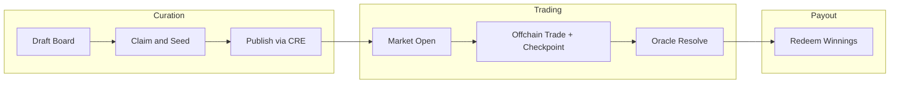
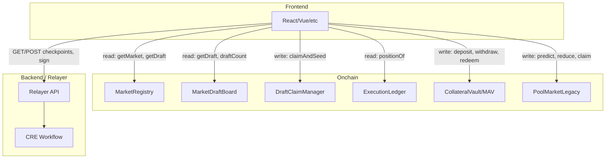
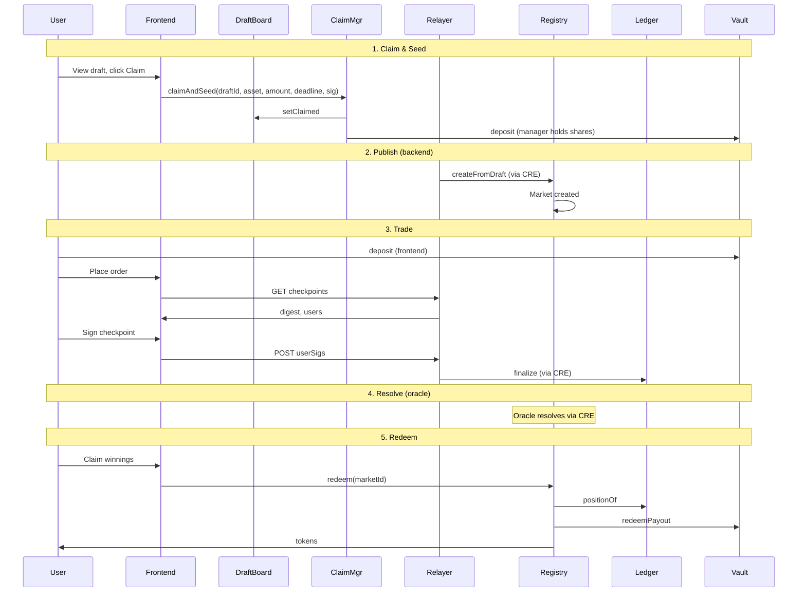
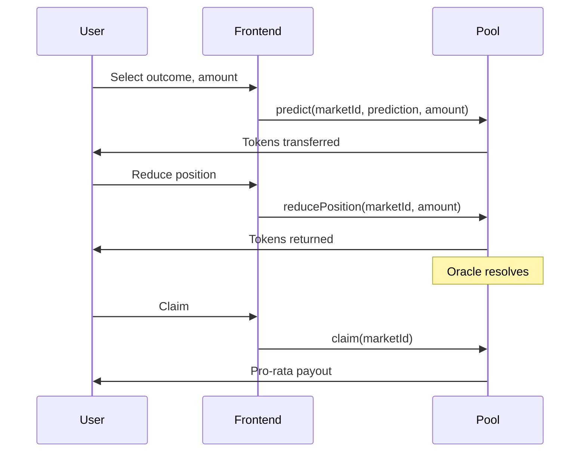

# RetroPick Frontend & UI/UX Integration Guide

Last updated: 2026-02-20  
Audience: Frontend engineers building the RetroPick prediction market UI  
Context: See [CurrentSmartContract.md](../CurrentSmartContract.md) for smart contract architecture details.

**See also:** [CRE integration](../cre/CREOverview.md) | [Relayer / Nitrolite Yellow](../relayer/RelayerOverview.md) | [Relayer API](../relayer/RelayerAPI.md)

---

## 1. Architecture Overview (User-Facing)

RetroPick has two production lanes. **For production UI, implement the Curated lane only.** The Legacy Pool lane is demo-only.

### 1.1 Production Lanes

| Lane | Description | Frontend Priority |
|------|-------------|-------------------|
| **Curated** | AI proposes drafts → Creator claims & seeds → Publish via CRE → Trade (checkpoint) → Oracle resolves → Redeem | **Primary** |
| **Legacy Pool** | Direct onchain predict/reduce/claim; pool-based payouts | Demo only, not production |

### 1.2 High-Level User Flow (Curated Path)



1. **Draft Board** — AI proposes market drafts; users browse and filter.
2. **Claim & Seed** — Creator claims draft, seeds liquidity (EIP-712 + token approve).
3. **Publish** — CRE workflow publishes draft to live market (backend-driven).
4. **Market Open** — Users deposit collateral, trade offchain.
5. **Checkpoint** — Operator collects signatures, submits checkpoints via relayer.
6. **Resolve** — Oracle delivers outcome via CRE; market becomes Resolved.
7. **Redeem** — Winners call `redeem(marketId)` to claim payouts.

### 1.3 Component Architecture



| Contract | Method | Params | Returns |
|----------|--------|--------|---------|
| `MarketDraftBoard` | `getDraft(draftId)` | `bytes32 draftId` | `Draft` struct |
| `MarketDraftBoard` | `getStatus(draftId)` | `bytes32 draftId` | `DraftStatus` enum |
| `MarketDraftBoard` | `draftCount()` | — | `uint256` |
| `MarketDraftBoard` | `getDraftIdAt(index)` | `uint256 index` | `bytes32 draftId` |

## 2. Contract-to-Feature Mapping

| Contract | Frontend Feature | User Role |
|----------|------------------|-----------|
| `MarketDraftBoard` | Draft discovery, draft status badges | All, Curator |
| `DraftClaimManager` | Claim draft, seed liquidity, EIP-712 signing | Creator/Curator |
| `LiquidityVault4626` | LP share display, deposit UI | LPs |
| `MarketFactory` (via CREPublishReceiver) | Publish flow (backend/relayer-driven) | Creator |
| `MarketRegistry` | Market list, market detail, status, redeem | All |
| `ExecutionLedger` | Position display (shares per outcome) | Trader |
| `CollateralVault` / `MultiAssetVault` | Deposit/withdraw, balance display | Trader |
| `ChannelSettlement` | Checkpoint submit/finalize (relayer-driven) | Operator, Trader (sign) |
| `PoolMarketLegacy` | Direct predict/reduce/claim (legacy demo) | Trader |

- `Proposed` → `Claimed` → `Published` | `Cancelled` | `Expired`

## 3. Feature Sections with Deep Flow

### 3.1 Draft Discovery and Curation

#### UI Screens

- **Draft List** — Paginated list of drafts with status badges
- **Draft Card** — Question, market type, timing, `minSeed`, `settlementAsset`
- **Claim Modal** — Seed amount input, asset selector, EIP-712 sign

#### Read Calls

| Contract | Method | Params | Notes |
|----------|--------|--------|-------|
| `DraftClaimManager` | `claimAndSeed` | `draftId`, `asset`, `seedAmount`, `deadline`, `sig` | Requires EIP-712 signature |
| `DraftClaimManager` | `unlockSeedShares` | `draftId` | Call after `tradingClose` |

#### Pre-requisites

1. **ERC20 approval**: `asset.approve(DraftClaimManager, seedAmount)`
2. **EIP-712 signature**: Sign `ClaimAndSeed(draftId, asset, seedAmount, deadline, nonce)`
3. **Validation**: `seedAmount >= draft.minSeed`, `asset == draft.settlementAsset` (or draft has no asset set)

#### EIP-712 ClaimAndSeed

```
Domain: DraftClaimManager / 1
TypeHash: ClaimAndSeed(bytes32 draftId,address asset,uint256 seedAmount,uint256 deadline,uint256 nonce)
```

Get nonce: `DraftClaimManager.nonces(user)`

#### Events

| Event | Use |
|-------|-----|
| `DraftClaimedAndSeeded(draftId, claimer, vault, seedAmount, seedShares)` | Confirm claim success |
| `SeedSharesUnlocked(draftId, claimer, shares)` | Confirm unlock success |

#### UX Notes

- Explain that seed is locked until `tradingClose`
- Show "Unlock seed shares" CTA when `block.timestamp >= draft.tradingClose`
- Read `seedSharesLocked(draftId)` and `seedUnlockTime(draftId)` before unlock

#### Frontend Responsibilities

- Show "Pending publish" or link to CRE workflow if user is creator
- Subscribe to `DraftPublished(draftId, marketId)` to update draft status and show market link
- Creator must sign EIP-712 `PublishFromDraft(draftId, paramsHash, chainId, nonce)` when backend requests

#### Events

- `DraftPublished(draftId, marketId)` — MarketRegistry
- `MarketCreated(marketId, question, creator)` — MarketRegistry
- `MarketCreatedTyped(marketId, marketType, outcomesCount)` — MarketRegistry (typed markets)

| Contract | Method | Params | Returns |
|----------|--------|--------|---------|
| `MarketRegistry` | `getMarket(marketId)` | `uint256 marketId` | `Market` struct |
| `MarketRegistry` | `status(marketId)` | `uint256 marketId` | `Status` enum |
| `MarketRegistry` | `marketType(marketId)` | `uint256 marketId` | `MarketType` enum |
| `MarketRegistry` | `getTradingClose(marketId)` | `uint256 marketId` | `uint48` |
| `MarketRegistry` | `getSettlementAsset(marketId)` | `uint256 marketId` | `address` |
| `MarketRegistry` | `getCreator(marketId)` | `uint256 marketId` | `address` |
| `MarketRegistry` | `getCategoricalOutcomes(marketId)` | `uint256 marketId` | `string[]` |
| `MarketRegistry` | `getTimelineWindows(marketId)` | `uint256 marketId` | `uint48[]` |
| `MarketRegistry` | `typedOutcomeIndex(marketId)` | `uint256 marketId` | `uint32` (winning outcome after resolve) |
| `MarketRegistry` | `liquidityVaultByMarketId(marketId)` | `uint256 marketId` | `address` |

#### Market Struct (MarketRegistry)

```solidity
struct Market {
    address creator;
    uint48 createdAt;
    uint48 expiry;
    uint48 tradingOpen;
    uint48 tradingClose;
    uint48 resolveTime;
    uint48 settledAt;
    bool settled;
    bool frozen;
    uint16 confidence;
    Prediction outcome;         // Yes/No for binary
    string question;
}
```

#### Status Derivation

- `Draft` — No creator (shouldn't appear in registry)
- `Open` — Trading open, not settled
- `Frozen` — `block.timestamp >= tradingClose`, not settled
- `Resolved` — Settled with winning outcome

#### Events

| Event | Use |
|-------|-----|
| `MarketCreated(marketId, question, creator)` | Append to market list |
| `MarketCreatedTyped(marketId, marketType, outcomesCount)` | Typed market created |
| `MarketResolved(marketId, winningOutcome, confidence)` | Enable redeem UI |

#### UX Notes

- Filter by `status`: Open, Frozen, Resolved
- Show `tradingOpen` / `tradingClose` / `resolveTime` for timing
- For categorical: show `getCategoricalOutcomes`; for timeline: show `getTimelineWindows`
- Winning outcome after resolve: binary uses `market.outcome`; typed uses `typedOutcomeIndex(marketId)`

| Contract | Method | Params | Returns |
|----------|--------|--------|---------|
| `CollateralVault` | `freeBalance(user)` | `address user` | `uint256` |
| `CollateralVault` | `lockedBalance(user, marketId, sessionId)` | `user`, `marketId`, `sessionId` | `uint256` |
| `MultiAssetVault` | `freeBalance(user, asset)` | `address user`, `address asset` | `uint256` |
| `MultiAssetVault` | `lockedBalance(user, asset, marketId, sessionId)` | — | `uint256` |
| `ExecutionLedger` | `positionOf(user, marketId, outcomeIndex)` | `user`, `marketId`, `outcomeIndex` | `int256` shares |

#### Events

| Event | Use |
|-------|-----|
| `Deposited(user, amount)` / `Deposited(user, asset, amount)` | Balance refresh |
| `Withdrawn(user, amount)` / `Withdrawn(user, asset, amount)` | Balance refresh |
| `CashDeltasApplied(...)` | Position/balance changed after checkpoint |
| `DeltasApplied(marketId, sessionId, deltaCount)` | Position changed |

#### UX Notes

- Show free vs locked; per-asset if using MultiAssetVault
- `positionOf` returns shares (int256); positive = long that outcome
- For binary: outcome 0 = Yes, 1 = No

- **GET** `/cre/checkpoints/:sessionId` — checkpoint spec (checkpoint, deltas, digest, users, chainId, channelSettlementAddress)
- **POST** `/cre/checkpoints/:sessionId` — body: `{ userSigs: { [address]: "0x..." } }`; returns `0x03`-prefixed payload

#### Read Calls

| Contract | Method | Params | Returns |
|----------|--------|--------|---------|
| `ChannelSettlement` | `latestNonce(marketId, sessionId)` | `marketId`, `sessionId` | `uint64` |

#### Events

| Event | Use |
|-------|-----|
| `CheckpointSubmitted(marketId, sessionId, nonce, stateHash, deltasHash)` | Pending checkpoint |
| `CheckpointFinalized(marketId, sessionId, nonce)` | Positions/cash updated |

#### UX Notes

- Integrate with relayer; show "Sign checkpoint" when relayer requests
- Display session state from relayer, not from chain
- After `CheckpointFinalized`, refresh positions via `positionOf` and balances

#### Read Calls

| Contract | Method | Params | Returns |
|----------|--------|--------|---------|
| `PoolMarketLegacy` | `getPrediction(marketId, user)` | `marketId`, `user` | `UserPrediction { amount, prediction, claimed }` |
| `PoolMarketLegacy` | `getTypedPrediction(marketId, user)` | `marketId`, `user` | `TypedPrediction { amount, outcomeIndex, claimed }` |
| `PoolMarketLegacy` | `getCategoricalPools(marketId)` | `marketId` | `uint256[]` |
| `PoolMarketLegacy` | `getTimelinePools(marketId)` | `marketId` | `uint256[]` |

#### Write Calls

| Contract | Method | Params | Notes |
|----------|--------|--------|-------|
| `PoolMarketLegacy` | `predict` | `marketId`, `prediction`, `amount` | Binary only; approve token first |
| `PoolMarketLegacy` | `predictOutcome` | `marketId`, `outcomeIndex`, `amount` | Categorical/timeline |
| `PoolMarketLegacy` | `reducePosition` | `marketId`, `amount` | Binary |
| `PoolMarketLegacy` | `reducePositionTyped` | `marketId`, `amount` | Typed |
| `PoolMarketLegacy` | `reduceAll` | `marketId` | Binary; clears position |
| `PoolMarketLegacy` | `reduceAllTyped` | `marketId` | Typed |
| `PoolMarketLegacy` | `claim` | `marketId` | After resolved; claim winnings |

#### Events

| Event | Use |
|-------|-----|
| `PredictionMade(marketId, predictor, prediction, amount)` | Refresh prediction |
| `PredictionMadeTyped(marketId, predictor, outcomeIndex, amount)` | Refresh typed prediction |
| `PositionReduced(marketId, user, amount)` | Refresh position |
| `PositionReducedTyped(marketId, user, outcomeIndex, amount)` | Refresh typed position |
| `WinningsClaimed(marketId, claimer, amount)` | Confirm claim |

#### UX Notes

- Show pool sizes: `getCategoricalPools` / `getTimelinePools` or binary `totalYesPool`/`totalNoPool` from `getMarket`
- **Cannot add to opposite outcome** — must `reduceAll` or `reduceAllTyped` first, then `predict`/`predictOutcome` for new outcome
- Approve `TOKEN` to PoolMarketLegacy before predict

#### Redemption

- User calls `redeem(marketId)` when market is resolved and user has winning shares.

#### Read Calls

| Contract | Method | Params | Returns |
|----------|--------|--------|---------|
| — | `hasRedeemed` | Not exposed onchain | Track `Redeemed` events or handle `AlreadyRedeemed` revert |
| `MarketRegistry` | `getMarket(marketId)` | `marketId` | Includes `settled`, `outcome` |
| `MarketRegistry` | `typedOutcomeIndex(marketId)` | `marketId` | Winning outcome index |
| `ExecutionLedger` | `positionOf(user, marketId, winningOutcome)` | — | Winning shares |

#### Write Calls

| Contract | Method | Params |
|----------|--------|--------|
| `MarketRegistry` | `redeem` | `marketId` |

#### Events

| Event | Use |
|-------|-----|
| `MarketResolved(marketId, winningOutcome, confidence)` | Enable "Claim winnings" |
| `Redeemed(marketId, user, amount)` | Confirm payout |

#### UX Notes

- Show "Claim winnings" only when: `status == Resolved`, `positionOf(user, marketId, winningOutcome) > 0`. Track whether user already redeemed via `Redeemed` events (no onchain getter for `hasRedeemed`)
- Redeem is one-shot per (marketId, user)
- Payout comes from MultiAssetVault or CollateralVault depending on config

#### UI Screens

- LP vault detail: TVL, share price, user shares
- Deposit/withdraw forms (standard ERC-4626)

#### Read Calls

| Contract | Method | Params | Returns |
|----------|--------|--------|---------|
| `LiquidityVault4626` | `balanceOf(account)` | `address account` | Share balance |
| `LiquidityVault4626` | `totalAssets()` | — | Total underlying |
| `LiquidityVault4626` | `convertToShares(assets)` | `uint256 assets` | Shares for assets |
| `LiquidityVault4626` | `convertToAssets(shares)` | `uint256 shares` | Assets for shares |
| `LiquidityVault4626` | `asset()` | — | Underlying ERC20 |
| `DraftClaimManager` | `getLiquidityVault(draftId)` | `bytes32 draftId` | Vault address |
| `MarketRegistry` | `liquidityVaultByMarketId(marketId)` | `uint256 marketId` | Vault address |

#### Write Calls

| Contract | Method | Params |
|----------|--------|--------|
| `LiquidityVault4626` | `deposit(assets, receiver)` | `uint256 assets`, `address receiver` |
| `LiquidityVault4626` | `withdraw(assets, receiver, owner)` | Standard ERC-4626 |
| `DraftClaimManager` | `unlockSeedShares` | `draftId` |

#### Events

| Event | Use |
|-------|-----|
| `PaidToTradingLedger(to, amount)` | Vault paid traders |
| `Transfer(from, to, amount)` | ERC20 share transfers |

- `draftCount()` — total drafts
- `getDraftIdAt(i)` — draftId at index `i` (0 to draftCount-1)
- Paginate by fetching batches of indices

### 4.2 Markets

- **No `marketCount`** — `nextMarketId` is internal and not exposed
- **Options**:
  1. **Event indexer** — Index `MarketCreated` / `MarketCreatedTyped` from block 0
  2. **Subgraph** — The Graph or similar
  3. **Backend API** — Backend maintains market list from events

**Recommendation**: Use event indexer, subgraph, or backend API for market list. Do not assume sequential IDs from 0 without indexing.

### 4.3 Linking Draft to Market

- `MarketFactory.draftIdByMarketId(marketId)` — returns `draftId` for a market (curated path)
- `DraftPublished(draftId, marketId)` event links them

### 5.2 PublishFromDraft (CREPublishReceiver)

- **Domain**: `CREPublishReceiver`, version `1`
- **TypeHash**: `PublishFromDraft(bytes32 draftId,bytes32 paramsHash,uint256 chainId,uint256 nonce)`
- **Nonce**: `crePublishReceiver.publishNonces(creator)`
- Typically backend/relayer requests this; frontend signs when prompted

### 5.3 Checkpoint (ChannelSettlement)

- Digest from relayer: `GET /cre/checkpoints/:sessionId` returns checkpoint spec including digest
- Users sign the digest; send signatures in `POST /cre/checkpoints/:sessionId`

From [yellowIntegration.md](../relayer/yellowIntegration.md):
- `CHANNEL_SETTLEMENT_ADDRESS` — for checkpoint path
- `OPERATOR` — operator key (relayer-side, not frontend)

**MarketType**
- Binary (0), Categorical (1), Timeline (2)

**DraftStatus**
- Proposed (0), Claimed (1), Published (2), Cancelled (3), Expired (4)

### 8.2 Client-Side Validation

- **Claim**: `seedAmount >= draft.minSeed`; `asset == draft.settlementAsset` or draft has no asset
- **Predict (Legacy)**: Market not settled; amount > 0; correct outcome (or reduce first)
- **Redeem**: Market resolved; `positionOf(user, marketId, winningOutcome) > 0`; user not yet redeemed (track via `Redeemed` events)
- **Unlock seed**: `block.timestamp >= seedUnlockTime(draftId)`; `seedSharesLocked > 0`



### 9.2 Legacy Pool Flow (Demo)



---

#### Draft Struct (MarketDraftBoard)

URIs are stored as hashes onchain for gas efficiency. Indexers should read full URIs from the `DraftProposed` event.

```solidity
struct Draft {
    bytes32 questionHash;
    bytes32 questionUriHash;    // keccak256 of URI; use DraftProposed event for full URI
    MarketType marketType;      // 0=Binary, 1=Categorical, 2=Timeline
    bytes32 outcomesHash;
    bytes32 outcomesUriHash;   // keccak256 of URI; use DraftProposed event for full URI
    bytes32 resolveSpecHash;
    uint48 tradingOpen;
    uint48 tradingClose;
    uint48 resolveTime;
    address settlementAsset;    // 0 = policy default
    uint256 minSeed;            // e.g. 50e6 for USDC
    DraftStatus status;
    address creator;            // set when claimed
    uint256 proposedAt;
}
```

#### DraftStatus Flow

---

#### Events to Subscribe

| Event | Contract | Indexed | Use Case |
|-------|----------|---------|----------|
| `DraftProposed(draftId, questionHash, marketType, resolveTime, questionURI, outcomesURI)` | MarketDraftBoard | draftId | New draft for list; index questionURI and outcomesURI for display |
| `DraftClaimed(draftId, claimer)` | MarketDraftBoard | draftId, claimer | Draft claimed (legacy) |
| `DraftClaimedAndSeeded(draftId, claimer, vault, seedAmount, seedShares)` | DraftClaimManager | draftId, claimer, vault | Seeded claim |
| `DraftPublished(draftId, marketId)` | MarketDraftBoard | draftId, marketId | Draft went live |

#### UX Notes

- Paginate via `draftCount()` and `getDraftIdAt(i)`
- Show `minSeed` and `settlementAsset` on each card
- **URIs**: Read `questionURI` and `outcomesURI` from `DraftProposed` event (indexers). `getDraft` returns only `questionUriHash` and `outcomesUriHash` (bytes32). Resolve IPFS/HTTP as needed for display.
- Filter by `status` (Proposed, Claimed, Published, etc.)

---

### 3.2 Claim and Seed (Creator Flow)

#### UI Screens

- **Claim Modal** — Amount input, asset selector, deadline (optional), "Sign & Claim"
- **Unlock Modal** — "Unlock Seed Shares" after `tradingClose`

#### Write Calls

---

### 3.3 Publish (CRE/Relayer Flow)

Publish is **backend-driven** via CRE workflow. The frontend does not call contracts directly for publish.

#### Flow

1. Creator (claimer) initiates publish via relayer/backend.
2. Backend/relayer sends report to CRE with schema `0x04`.
3. `CREPublishReceiver` processes: verifies creator signature, calls `MarketFactory.createFromDraft`.

---

### 3.4 Market Browsing and Detail

#### UI Screens

- **Market List** — Filter by status (Open, Frozen, Resolved)
- **Market Detail** — Question, outcomes, timing, settlement asset, positions
- **Outcome Selection** — For trading (curated path: relayer; legacy: onchain)

#### Read Calls

---

### 3.5 User Balances and Positions

#### UI Screens

- **Portfolio** — Aggregated positions across markets
- **Balance Card** — Free balance, locked balance, per-asset (MAV)
- **Position by Market** — Shares per outcome

#### Read Calls

---

### 3.6 Trading (Curated Path)

Trading in the curated path is **offchain** with checkpoint settlement. The frontend typically talks to a **relayer**, not the contract directly for order placement.

#### Flow

1. User places order via relayer/backend.
2. Session state updates offchain.
3. When checkpoint is ready, relayer fetches digest via `GET /cre/checkpoints/:sessionId`.
4. Frontend prompts user to sign checkpoint (EIP-712).
5. User signs; frontend sends signatures to `POST /cre/checkpoints/:sessionId`.
6. Relayer builds payload, sends to CRE workflow for onchain finalization.

#### Relayer API (see [yellowIntegration.md](../relayer/yellowIntegration.md))

---

### 3.7 Trading (Legacy Pool Path)

Direct onchain trading. Only use for demo; not production.

#### UI Screens

- Order form: amount, outcome (Yes/No or outcome index)
- Position view: current prediction, reduce/all controls

---

### 3.8 Resolution and Redemption

Resolution is **oracle-driven** via CRE. The frontend does not resolve; it subscribes to events.

#### Resolution

- Oracle sends report → `SettlementRouter` → `MarketRegistry.onReport(0x01...)` → `resolve`
- Frontend: subscribe to `MarketResolved(marketId, winningOutcome, confidence)`

---

### 3.9 LP Vault (Liquidity Providers)

Per-market ERC-4626 vault for LP liquidity. LPs deposit assets; fee donations increase share price.

---

## 4. Enumerating Markets and Drafts

### 4.1 Drafts

---

## 5. EIP-712 Signing Flows (Frontend)

### 5.1 ClaimAndSeed (DraftClaimManager)

- **Domain**: `DraftClaimManager`, version `1`
- **TypeHash**: `ClaimAndSeed(bytes32 draftId,address asset,uint256 seedAmount,uint256 deadline,uint256 nonce)`
- **Nonce**: `draftClaimManager.nonces(user)`
- **Digest**: Use `draftClaimManager.digestClaimAndSeed(draftId, asset, seedAmount, deadline, user)` (view) or compute EIP-712 digest client-side

---

## 6. Deployment-Dependent Configuration

Frontend needs these per network:

| Config | Source | Use |
|--------|--------|-----|
| Chain ID | Network | EIP-712, RPC |
| MarketRegistry | Deploy output | Market reads/writes |
| MarketDraftBoard | Deploy output | Draft reads |
| DraftClaimManager | Deploy output | Claim, unlock |
| CollateralVault | Deploy output | Deposit, withdraw (single-asset) |
| MultiAssetVault | Deploy output | Deposit, withdraw (multi-asset) |
| ExecutionLedger | Deploy output | Position reads |
| ChannelSettlement | Deploy output | Checkpoint flow, latestNonce |
| LiquidityVaultFactory | Deploy output | Vault by draft |
| Relayer URL | `.env` | `GET/POST /cre/checkpoints/:sessionId` |

---

## 7. Data Model Reference (Quick Lookup)

### 7.1 MarketRegistry.Market

| Field | Type | Description |
|-------|------|-------------|
| creator | address | Market creator |
| createdAt | uint48 | Creation timestamp |
| expiry | uint48 | Expiry (0 = no expiry) |
| tradingOpen | uint48 | When trading opens |
| tradingClose | uint48 | When trading closes |
| resolveTime | uint48 | When resolution allowed |
| settledAt | uint48 | Settlement timestamp |
| settled | bool | Resolution applied |
| frozen | bool | Trading closed |
| confidence | uint16 | Oracle confidence |
| outcome | Prediction | Yes/No for binary |
| question | string | Market question |

### 7.2 MarketDraftBoard.Draft

| Field | Type | Description |
|-------|------|-------------|
| questionHash | bytes32 | Question hash |
| questionUriHash | bytes32 | keccak256 of question URI; full URI in DraftProposed event |
| marketType | MarketType | 0=Binary, 1=Categorical, 2=Timeline |
| outcomesHash | bytes32 | Outcomes hash |
| outcomesUriHash | bytes32 | keccak256 of outcomes URI; full URI in DraftProposed event |
| resolveSpecHash | bytes32 | Resolution spec |
| tradingOpen | uint48 | Trading open time |
| tradingClose | uint48 | Trading close time |
| resolveTime | uint48 | Resolve time |
| settlementAsset | address | 0 = default |
| minSeed | uint256 | Min seed amount |
| status | DraftStatus | Proposed/Claimed/Published/etc |
| creator | address | Set when claimed |
| proposedAt | uint256 | Proposal timestamp |

### 7.3 ShadowTypes (Relayer Integration)

```solidity
struct Checkpoint {
    uint256 marketId;
    bytes32 sessionId;
    uint64 nonce;
    uint64 validAfter;
    uint64 validBefore;
    uint48 lastTradeAt;
    bytes32 stateHash;
    bytes32 deltasHash;
    bytes32 riskHash;
}

struct Delta {
    address user;
    uint32 outcomeIndex;
    int128 sharesDelta;
    int128 cashDelta;
}
```

### 7.4 Enums

**IMarketRegistry.Status**
- Draft, Open, Frozen, Resolved, Closed

---

## 8. Error Handling and Validation

### 8.1 Contract Error Mapping

| Error | User-Friendly Message |
|-------|------------------------|
| `DraftNotProposed` | This draft is no longer available to claim |
| `SeedTooLow` | Seed amount must be at least {minSeed} |
| `AssetMismatch` | Selected token does not match market settlement asset |
| `ClaimExpired` | Claim window has expired |
| `InvalidSignature` | Signature invalid or expired; try again |
| `NothingToRedeem` | No winning shares to redeem |
| `AlreadyRedeemed` | Winnings already claimed |
| `MarketNotSettled` | Market has not been resolved yet |
| `InsufficientFreeBalance` | Not enough balance; deposit first |
| `WrongOutcomeToAdd` | Reduce current position before changing outcome |
| `CannotReduceMoreThanPosition` | Amount exceeds your position |

---

## 9. Diagrams

### 9.1 Curated Flow (End-to-End)

---

## 10. Summary Checklist for Frontend Engineers

1. **Draft discovery** — Use `MarketDraftBoard.draftCount`, `getDraftIdAt`, `getDraft`, `getStatus`
2. **Claim & seed** — EIP-712 sign, then `DraftClaimManager.claimAndSeed`; show unlock when `tradingClose` passed
3. **Publish** — Backend-driven; subscribe to `DraftPublished`, `MarketCreated`
4. **Market list** — Index events or use backend; no `marketCount` onchain
5. **Market detail** — `getMarket`, `status`, `marketType`, outcomes, timing
6. **Balances** — `freeBalance`, `lockedBalance` (CollateralVault or MultiAssetVault)
7. **Positions** — `ExecutionLedger.positionOf(user, marketId, outcomeIndex)`
8. **Trading (curated)** — Integrate relayer `GET/POST /cre/checkpoints/:sessionId`; user signs checkpoint
9. **Trading (legacy)** — `predict`, `predictOutcome`, `reducePosition`, `reduceAll`; cannot add to opposite outcome without reducing first
10. **Redeem** — `MarketRegistry.redeem(marketId)` when resolved and user has winning shares
11. **LP vault** — ERC-4626 `deposit`/`withdraw`; display share balance and TVL
12. **Errors** — Map contract reverts to user-friendly messages
