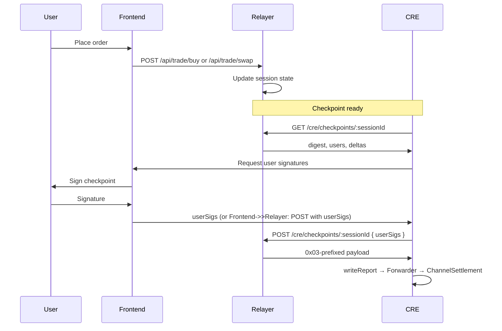

# Relayer Integration (Frontend)

**Last updated:** 2026-03-01  
**Audience:** Frontend engineers integrating checkpoint signing and trading  
**Context:** [RelayerAPI.md](../relayer/RelayerAPI.md) | [FrontendIntegration.md](../relayer/FrontendIntegration.md)

---

## 1. What the Relayer Does

The relayer is the **off-chain trading engine**. It:

- Maintains **session state** (positions, balances, LS-LMSR pricing)
- Exposes **trading API** (place orders)
- Builds **checkpoint payloads** and collects user signatures
- Serves **CRE endpoints** — CRE workflows fetch payloads from here

**Frontend never calls contracts for checkpoint submit.** CRE delivers payloads via Chainlink Forwarder. The frontend only provides user signatures to the relayer.

---

## 2. Trading Flow



---

## 3. Checkpoint Signing Flow (Frontend)

### 3.1 Step 1: Get Checkpoint Spec

**GET** `/cre/checkpoints/:sessionId`

**Response (key fields):**

```json
{
  "sessionId": "0x...",
  "marketId": "0",
  "checkpoint": {
    "marketId": "0",
    "sessionId": "0x...",
    "nonce": "1",
    "validAfter": "0",
    "validBefore": "0",
    "lastTradeAt": 0,
    "stateHash": "0x...",
    "deltasHash": "0x...",
    "riskHash": "0x..."
  },
  "deltas": [
    { "user": "0x...", "outcomeIndex": 0, "sharesDelta": "10", "cashDelta": "-1000" }
  ],
  "digest": "0x...",
  "users": ["0x...", "0x..."],
  "chainId": 43113,
  "channelSettlementAddress": "0xFA5D0e64B0B21374690345d4A88a9748C7E22182"
}
```

| Field | Use |
|-------|-----|
| `digest` | EIP-712 digest to sign (or use checkpoint + domain to build) |
| `users` | List of addresses that must sign |
| `channelSettlementAddress` | EIP-712 `verifyingContract` |
| `chainId` | EIP-712 domain chainId |
| `checkpoint` | Full checkpoint struct (for typed data signing) |

### 3.2 Step 2: User Signs

For each user in `users`:

- **Option A:** Sign the `digest` directly (personal_sign)
- **Option B:** Build EIP-712 typed data from `checkpoint` and sign (recommended for wallet UX)

Domain: `ShadowPool` v1, `chainId`, `verifyingContract` = `channelSettlementAddress`.

### 3.3 Step 3: Send Signatures

**POST** `/cre/checkpoints/:sessionId`

**Body:**

```json
{
  "userSigs": {
    "0xUserAddress1": "0x...",
    "0xUserAddress2": "0x..."
  }
}
```

**Response:**

```json
{
  "payload": "0x03...",
  "format": "ChannelSettlement"
}
```

The frontend does **not** send this payload on-chain. The CRE workflow fetches it and delivers via `writeReport`.

---

## 4. After Checkpoint Finalized

- Subscribe to `ChannelSettlement.CheckpointFinalized(marketId, sessionId, nonce)`
- Refresh `OutcomeToken1155.balanceOf` for affected users
- Refresh vault balances (`freeBalance`, `availableBalance`)

---

## 5. Configuration (Frontend)

| Config | Source | Use |
|--------|--------|-----|
| Relayer base URL | `.env` | e.g. `http://localhost:8790` |
| `channelSettlementAddress` | Deploy / relayer response | EIP-712 verifyingContract; also in [DeploymentConfig.md](DeploymentConfig.md) |

**Note:** `OPERATOR_PRIVATE_KEY` is relayer-side only; frontend does not use it.

---

## 6. Error Handling

| Scenario | Handling |
|----------|----------|
| 404 sessionId | Session not found; show user message |
| 400 missing userSig | Relayer requires all `users` to sign; prompt missing signers |
| 503 CHANNEL_SETTLEMENT_ADDRESS not set | Relayer misconfigured; contact backend |
| 503 OPERATOR_PRIVATE_KEY missing | Relayer cannot build payload; contact backend |

---

## 7. References

- [RelayerAPI.md](../relayer/RelayerAPI.md) — Full endpoint specs
- [FrontendIntegration.md](../relayer/FrontendIntegration.md) — Condensed relayer overview
- [CheckpointEIP712.md](../relayer/CheckpointEIP712.md) — EIP-712 struct definitions
- [EIP712Signing.md](EIP712Signing.md) — All signing flows
- [DeploymentConfig.md](DeploymentConfig.md) — ChannelSettlement address
