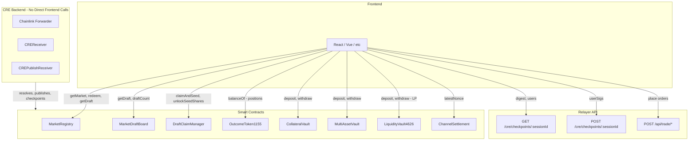

# RetroPick System Integration — Frontend Perspective

**Last updated:** 2026-03-01  
**Audience:** Frontend engineers integrating RetroPick  
**Context:** [CurrentSmartContract.md](../CurrentSmartContract.md) | [CREOverview.md](../cre/CREOverview.md) | [RelayerOverview.md](../relayer/RelayerOverview.md)

---

## 1. Overview

RetroPick integrates three pillars that frontend engineers must understand:

| Pillar | Role | Frontend interacts? |
|--------|------|---------------------|
| **Smart contracts** | On-chain custody, settlement, registry, vaults | Yes — direct calls (read/write) |
| **Relayer** | Off-chain trading engine; checkpoint signing orchestration | Yes — API calls for trades and checkpoint signing |
| **CRE (Chainlink)** | Oracle delivery; outcome resolution; publish; checkpoint submission | No — backend-driven; frontend subscribes to events |

---

## 2. Architecture (Frontend View)



---

## 3. Feature → Contract / API Mapping

| Feature | Contract / API | Frontend Action |
|---------|----------------|-----------------|
| Draft discovery | MarketDraftBoard | `draftCount`, `getDraftIdAt`, `getDraft`, `getStatus` |
| Claim & seed draft | DraftClaimManager | EIP-712 sign; `claimAndSeed(draftId, asset, amount, deadline, sig)` |
| Unlock seed shares | DraftClaimManager | `unlockSeedShares(draftId)` after `tradingClose` |
| Publish (creator) | CREPublishReceiver (via backend) | Sign `PublishFromDraft` when backend requests |
| Market list / detail | MarketRegistry | `getMarket`, `status`, `marketType`, outcomes; index events for list |
| Position display | OutcomeToken1155 | `balanceOf(user, tokenId)` where `tokenId = id(marketId, outcomeIndex)` |
| Deposit / withdraw | CollateralVault or MultiAssetVault | `deposit`, `withdraw`; `freeBalance`, `availableBalance` |
| LP vault | LiquidityVault4626 | `deposit`, `withdraw`, `balanceOf`, `totalAssets` |
| Place order | Relayer | `POST /api/trade/buy` or `POST /api/trade/swap` (if used) |
| Sign checkpoint | Relayer | `GET /cre/checkpoints/:sessionId` → digest; user signs; `POST` with `userSigs` |
| Redeem winnings | MarketRegistry | `redeem(marketId)` when resolved and user has winning shares |
| Faucet (testnet) | Faucet | `claim(token)` — rate-limited per user per token |
| LP risk metrics | MarketRiskManager | `maxLpPayout(marketId)`, `reservedLpPayout(marketId)` (optional) |

---

## 4. What the Frontend Does NOT Call

| Flow | Who delivers | Frontend role |
|------|--------------|---------------|
| **Outcome resolution** | CRE → Forwarder → CREReceiver → SettlementRouter → MarketRegistry | Subscribe to `MarketResolved` event |
| **Checkpoint on-chain submit** | CRE fetches from relayer → writeReport → CREReceiver → ChannelSettlement | Provide user signatures to relayer; CRE handles delivery |
| **Publish from draft** | CRE → Forwarder → CREPublishReceiver → MarketFactory | Creator signs `PublishFromDraft`; backend sends to CRE |
| **Checkpoint finalize** | Anyone (relayer, bot, CRE) | Frontend does not call; subscribe to `CheckpointFinalized` |

---

## 5. Flow Summary

### 5.1 Curated Path (Production)

```
Draft Board → Claim & Seed (EIP-712) → Publish (CRE) → Market Open → 
Trade (relayer) → Sign Checkpoint (relayer + EIP-712) → Resolve (CRE) → Redeem
```

- **Frontend calls:** MarketDraftBoard, DraftClaimManager, MarketRegistry, OutcomeToken1155, vaults, relayer checkpoint endpoints
- **Frontend subscribes:** DraftPublished, MarketCreated, MarketResolved, CheckpointFinalized, Redeemed
- **Frontend signs:** ClaimAndSeed, PublishFromDraft (when requested), Checkpoint (when relayer requests)

### 5.2 CRE Ingress (Reference Only)

For understanding, not implementation:

- **0x03** (checkpoint): Relayer builds payload → CRE fetches → `writeReport` → CREReceiver → ChannelSettlement
- **0x04** (publish): Creator signature + CRE workflow → CREPublishReceiver → MarketFactory
- **Outcome** (no prefix): Oracle data → CRE → CREReceiver → MarketRegistry.resolve

See [CREPipelineDiagram.md](../cre/CREPipelineDiagram.md) for full sequence diagrams.

---

## 6. References

| Document | Description |
|----------|-------------|
| [IntegrationMatrix.md](../IntegrationMatrix.md) | Contract → report type → CRE path |
| [CREPipelineDiagram.md](../cre/CREPipelineDiagram.md) | Full CRE flow diagrams |
| [RelayerArchitecture.md](../relayer/RelayerArchitecture.md) | Relayer session state, checkpoint lifecycle |
| [RelayerAPI.md](../relayer/RelayerAPI.md) | CRE endpoint specs |
| [Frontend.md](Frontend.md) | Detailed frontend integration guide |
| [AppFlow.md](AppFlow.md) | User flows by role |
