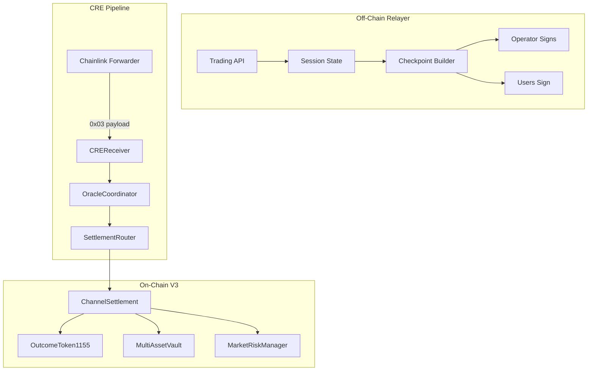

# Relayer Architecture

**Last updated:** 2026-03-01  
**Context:** [CurrentSmartContract.md](../CurrentSmartContract.md)  
**Source:** `apps/relayer` (session state, LS-LMSR, checkpoint building)

---

## 1. Executive Summary

The **relayer** is a pure **off-chain trading engine** for RetroPick. It maintains session state (positions, balances, LS-LMSR q-vector), runs pricing, and builds signed EIP-712 checkpoints. Settlement is delivered on-chain via the CRE (Chainlink Runtime Environment) pipeline. The relayer does **not** send on-chain transactions; it prepares signed data for the CRE workflow to submit.

**Key point:** The relayer is **Nitrolite-independent**. Checkpoint building, EIP-712 signing, session state, and LS-LMSR pricing use only viem and in-memory state. Optional Nitrolite/Yellow WebSocket glue exists but is not used for checkpoint signing.

---

## 2. High-Level Flow



1. **Off-chain:** Users trade via relayer API. Relayer maintains session state; LS-LMSR pricing runs off-chain.
2. **Checkpoint build:** Relayer builds `Checkpoint` + `Delta[]`; operator and users sign. CRE workflow fetches payload from relayer.
3. **On-chain ingress:** CRE sends `0x03 || payload` to CREReceiver → OracleCoordinator → SettlementRouter → `ChannelSettlement.submitCheckpointFromPayload`.
4. **Challenge window:** 30 minutes; users can challenge with newer nonce.
5. **Finalize:** After window, anyone calls `ChannelSettlement.finalizeCheckpoint`; shares and cash deltas applied.

---

## 3. Session State Model

The relayer maintains **per-market, per-session** state.

### 3.1 SessionState Structure

From `sessionStore.ts`:

```
SessionState = {
  sessionId, marketId, vaultId, epoch, nonce,
  q: number[],           // LS-LMSR outcome vector (net shares per outcome)
  bParams: { b, b0?, alpha? },
  accounts: Map<address, { balance, positions, feeAccrued, initialBalance? }>,
  prevStateHash, feeParams, resolveTime
}
```

| Field | Meaning |
|-------|---------|
| `q` | Net outcome shares in the AMM; updated by BuyShares/SwapShares |
| `accounts` | Per-user balance (cash) and positions (shares per outcome) |
| `initialBalance` | Balance at session start; used to compute `cashDelta = initialBalance - balance` |
| `nonce` | Strictly increasing; replay protection and challenge ordering |

### 3.2 Delta Computation (`sessionStateToDeltas`)

Checkpoints use **incremental deltas**, not full snapshots.

**Algorithm (from `buildCheckpointPayload.ts`):**

1. **Cash delta:** `cashDelta = initialBalance - balance` (positive = user received; negative = user spent).
2. **Position deltas:** For each outcome with non-zero shares, emit `Delta{ user, outcomeIndex, sharesDelta: position, cashDelta }`; only the **first** outcome gets the cash delta (to avoid double-counting).
3. **Cash-only users** (no positions): One Delta with `outcomeIndex=0`, `sharesDelta=0`, `cashDelta=initialBalance-balance`.

Result: One Delta per `(user, outcome)` with non-zero shares; users with only cash changes get one Delta.

---

## 4. Checkpoint Lifecycle

### 4.1 Submit

- CRE workflow fetches payload from relayer → `writeReport(0x03||payload)` → Forwarder → CREReceiver → OracleCoordinator.submitSession → SettlementRouter.finalizeSession → **ChannelSettlement.submitCheckpointFromPayload**.
- On submit: ChannelSettlement computes reserves via `_computeReserves`, calls `vault.reserve(user, amount)` for debtors, stores `reserveUsers`, `reserveAmts`, `createdAt`.

### 4.2 Challenge Window (30 min)

- Users can **challenge** with a newer nonce; old pending reserves are released, new reserves applied.
- Finalize is **rejected** until `block.timestamp >= challengeDeadline`.

### 4.3 Finalize

- **Anyone** can call `ChannelSettlement.finalizeCheckpoint(marketId, sessionId, deltas)` — permissionless.
- Deltas come from relayer `GET /cre/checkpoints/:sessionId`.
- Finalize: mint/burn OutcomeToken1155, apply cash deltas, LP counterparty, fee routing, **release pending reserves**, delete pending.

### 4.4 Cancel (Escape Hatch)

- After `CANCEL_DELAY` (6 hours), **anyone** can call `cancelPendingCheckpoint(marketId, sessionId)` to release stuck reserves if relayer never finalized.

---

## 5. LS-LMSR Pricing

The relayer uses **Liquidity-Sensitive Logarithmic Market Scoring Rule** for prediction market pricing:

| Symbol | Meaning |
|--------|---------|
| `q` | Outcome share vector (q_i = net shares for outcome i) |
| `b` | Liquidity parameter |
| `C(q)` | Cost function: `b·ln(Σ exp(q_i/b))` |
| `p_i(q)` | Price for outcome i: `exp(q_i/b) / Σ exp(q_j/b)` |

**BuyShares:** `CostBuy(q, k, δ) = C(q + δ·e_k) - C(q)` — cost to buy δ shares of outcome k.  
**SwapShares:** `CostSwap(q, i, j, δ) = C(q - δ·e_i + δ·e_j) - C(q)` — cost to swap δ from i to j.

Session state tracks `q`, `accounts`, and `nonce`. Trades update `q` and account state; checkpoints commit the net **deltas** to the chain.

---

## 6. V3-Escrow Reserves

**Reserve computation** (`_computeReserves`) matches `_applyCashDeltasAndFees` fee logic:

- `reserve_u = max(0, -netCash_u)` per user (only debtors reserved).
- `netCash_u` uses same fee split as finalize (positive cash deltas get fee deducted).

**Withdraw constraint:** `amount <= freeBalance - reservedBalance`. Users cannot withdraw reserved amounts during the challenge window, preventing griefing.

---

## 7. CRE Endpoints

| Endpoint | Purpose |
|----------|---------|
| `GET /cre/checkpoints` | List checkpoint metadata for all active sessions |
| `GET /cre/checkpoints/:sessionId` | Get digest, users, deltas — workflow collects user signatures |
| `POST /cre/checkpoints/:sessionId` | Build full payload with operator + user sigs; returns `0x03`-prefixed payload |
| `GET /cre/sessions` | List sessions ready for finalization (legacy + checkpoint) |
| `GET /cre/sessions/:sessionId` | Legacy SessionFinalizer format |

---

## 8. Who Finalizes?

Finalize is **permissionless**. Options:

1. **Relayer finalizer:** Relayer exposes `POST /cre/finalize/:sessionId` (or similar); relayer submits `finalizeCheckpoint` tx via RPC.
2. **CRE workflow:** Workflow can submit finalize tx after challenge window.
3. **Third-party service:** Any bot can watch for `challengeDeadline` and call `finalizeCheckpoint`.

Deltas for finalize come from `GET /cre/checkpoints/:sessionId`; the relayer is the source of truth.

---

## 9. See Also

- [CheckpointEIP712.md](CheckpointEIP712.md) — EIP-712 domain, type strings, digest
- [ContractRelayerInterface.md](ContractRelayerInterface.md) — Contract methods relayer must know
- [RelayerAPI.md](RelayerAPI.md) — CRE endpoint specs
- [StandaloneRelayerPlan.md](StandaloneRelayerPlan.md) — Nitrolite removal plan
