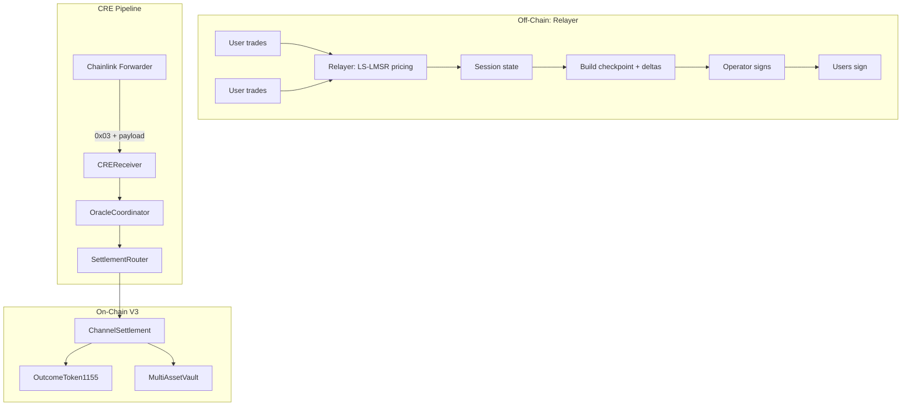

# Relayer Overview

**Last updated:** 2026-03-01  
**Context:** [CurrentSmartContract.md](../CurrentSmartContract.md) | [RelayerArchitecture.md](RelayerArchitecture.md)

---

## 1. What Is the Relayer?

The **relayer** is the **off-chain trading engine** for RetroPick. It:

- Maintains **session state** (positions, balances, LS-LMSR q-vector)
- Runs **LS-LMSR pricing** for trades
- Exposes **trading API** (`POST /api/trade/buy`, `POST /api/trade/swap`)
- Builds **checkpoint payloads** with operator + user EIP-712 signatures
- Serves **CRE endpoints** (`GET/POST /cre/checkpoints/:sessionId`) for workflow integration

**The relayer does not send on-chain transactions.** It prepares signed data; the CRE workflow delivers it on-chain via the Chainlink Forwarder.

---

## 2. Standalone Mode (Primary)

The relayer operates as a **standalone off-chain trading engine**. It uses:

- **viem** for EIP-712 signing and ABI encoding
- **In-memory session state** (LS-LMSR, accounts, nonce)
- **No Nitrolite or Yellow WebSocket** required

Checkpoint building and trading are **Nitrolite-independent**. Optional Nitrolite/Yellow glue may exist for future use but is not used for checkpoint signing.

---

## 3. Nitrolite / Yellow (Optional, Legacy)

**Nitrolite** ([`@erc7824/nitrolite`](https://github.com/erc7824/nitrolite)) is a state channel framework. **Yellow Network** provides clearnet and chain abstraction. RetroPick's relayer *can* use Nitrolite for custody/adjudicator setup, but:

- **Checkpoint path** uses only viem + EIP-712; no Nitrolite calls for signing
- **NitroliteClient** and **Yellow WebSocket** are optional; the core relayer works without them

See [StandaloneRelayerPlan.md](StandaloneRelayerPlan.md) for running without Nitrolite.

---

## 4. Checkpoint vs Legacy Session

RetroPick has two session settlement paths:

| Aspect | Checkpoint (Primary) | Legacy |
|--------|----------------------|--------|
| **Contract** | ChannelSettlement | SessionFinalizer |
| **Payload** | `(Checkpoint, Delta[], opSig, users, userSigs)` | `SessionPayload{participants, balances, signatures, backendSignature}` |
| **Signing** | Operator + every delta user | Backend + each participant |
| **State model** | Deltas (incremental) | Balances snapshot |
| **Relayer CRE path** | `GET/POST /cre/checkpoints/:sessionId` | `GET /cre/sessions/:sessionId` |

---

## 5. Lifecycle

1. **Off-chain:** Users trade via relayer API. Relayer maintains session state; LS-LMSR pricing runs off-chain.
2. **Checkpoint build:** Relayer builds `Checkpoint` + `Delta[]`; operator and users sign. CRE workflow fetches payload from relayer.
3. **On-chain ingress:** CRE sends `0x03 || payload` to CREReceiver → OracleCoordinator → SettlementRouter → `ChannelSettlement.submitCheckpointFromPayload`.
4. **Challenge window:** 30 minutes; users can challenge with newer nonce.
5. **Finalize:** After window, anyone calls `ChannelSettlement.finalizeCheckpoint`; shares and cash deltas applied.

---

## 6. Key Concepts

| Concept | Meaning |
|---------|---------|
| **Session** | Per-market/per-session off-chain trading channel; gasless; LS-LMSR pricing |
| **Checkpoint** | Signed state commitment: `(marketId, sessionId, nonce, stateHash, deltasHash)` |
| **Delta** | Netted effects per user: `(user, outcomeIndex, sharesDelta, cashDelta)` |
| **Operator** | Trusted signer; signs checkpoints; same key as relayer `OPERATOR_PRIVATE_KEY` |

---

## 7. LS-LMSR Pricing

| Symbol | Meaning |
|--------|---------|
| `q` | Outcome share vector (q_i = net shares for outcome i) |
| `b` | Liquidity parameter |
| `C(q)` | Cost function: `b·ln(Σ exp(q_i/b))` |
| `p_i(q)` | Price for outcome i: `exp(q_i/b) / Σ exp(q_j/b)` |

**BuyShares:** `CostBuy(q, k, δ) = C(q + δ·e_k) - C(q)`  
**SwapShares:** `CostSwap(q, i, j, δ) = C(q - δ·e_i + δ·e_j) - C(q)`

---

## 8. See Also

- [RelayerArchitecture.md](RelayerArchitecture.md) — Full architecture, session state, lifecycle
- [CheckpointEIP712.md](CheckpointEIP712.md) — Checkpoint/Delta structs, EIP-712
- [RelayerAPI.md](RelayerAPI.md) — CRE endpoint specs
- [RelayerConfiguration.md](RelayerConfiguration.md) — Env vars, Standalone vs Nitrolite
- [StandaloneRelayerPlan.md](StandaloneRelayerPlan.md) — Nitrolite removal plan
- [ContractRelayerInterface.md](ContractRelayerInterface.md) — Contract methods
- [FrontendIntegration.md](FrontendIntegration.md) — Frontend signing flow
