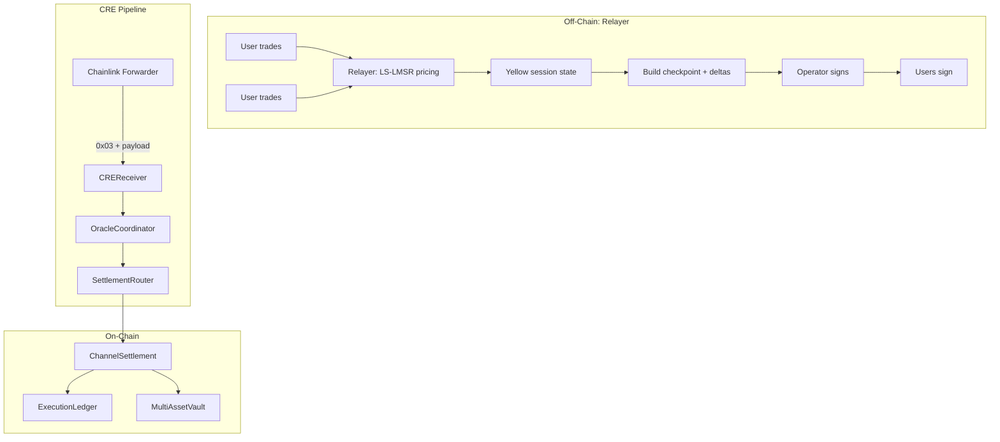

# Relayer and Nitrolite Yellow Overview

**Last updated:** 2026-02-20  
**Context:** [CurrentSmartContract.md](../CurrentSmartContract.md) | [e2eAvalanceFujiTest.md](../../../e2e/e2eAvalanceFujiTest.md)

---

## 1. What Is Nitrolite?

**Nitrolite** ([`@erc7824/nitrolite`](https://github.com/erc7824/nitrolite)) is a lightweight **state channel framework** for Ethereum and EVM-compatible chains, built on the **ERC-7824** standard. It enables:

- **Off-chain transactions** — Instant finality between parties; minimal on-chain footprint
- **High throughput** — Thousands of transactions per second
- **Security guarantees** — Cryptographic proofs and challenge periods; same security as on-chain
- **Chain-agnostic** — Works with any EVM chain

### 1.1 Nitrolite Components

| Component | Role |
|-----------|------|
| **Smart Contracts** | ChannelHub, ChannelEngine for state channel management |
| **Clearnode** | Message broker and off-chain state manager (Yellow Network) |
| **TypeScript SDK** | Client library; RetroPick relayer uses `NitroliteClient`, `WalletStateSigner` |
| **Custody / Adjudicator** | On-chain contracts for asset custody and dispute resolution |

### 1.2 Yellow Network Relationship

**Yellow Network** is a decentralized clearing and settlement network that uses Nitrolite. It provides:

- **Clearnet** — Sandbox/production environment: `wss://clearnet-sandbox.yellow.com/ws`
- **Chain abstraction** — Unified balance across chains
- **Clearnodes** — Trustless execution layers for off-chain operations
- **Dispute resolution** — Via ERC-7824 contracts if a Clearnode is unavailable

RetroPick's relayer uses the **Nitrolite TypeScript SDK** for custody/adjudicator setup and state signing. The relayer itself implements the **session state** and **LS-LMSR pricing**; Nitrolite provides the channel infrastructure.

---

## 2. Relayer Role

The **relayer** (`apps/relayer`) is the off-chain execution layer for Nitrolite Yellow sessions. It:

- Maintains **Yellow session state** (positions, balances, nonce, q-vector for LS-LMSR)
- Runs **LS-LMSR pricing** for trades
- Exposes **trading API** (`POST /api/trade/buy`, `POST /api/trade/swap`)
- Builds **checkpoint payloads** with operator + user signatures
- Serves **CRE endpoints** (`GET/POST /cre/checkpoints/:sessionId`) for workflow integration

**The relayer does not send on-chain transactions.** It prepares signed data; the CRE workflow delivers it on-chain via the Chainlink Forwarder.

---

## 3. Nitrolite Yellow vs Legacy Yellow

RetroPick has two Yellow session implementations. **DeployTestnet and production use Nitrolite only.**

| Aspect | Nitrolite Yellow (Production) | Legacy Yellow |
|--------|-------------------------------|---------------|
| **Contract** | `ChannelSettlement` | `SessionFinalizer` |
| **Payload** | `(Checkpoint, Delta[], opSig, users, userSigs)` | `SessionPayload{participants, balances, signatures, backendSignature}` |
| **Signing** | Operator + every delta user | Backend + each participant |
| **State model** | Deltas (incremental) | Balances snapshot |
| **Deployed in DeployTestnet** | Yes | No |
| **Relayer CRE path** | `GET/POST /cre/checkpoints/:sessionId` | `GET /cre/sessions/:sessionId` |

---

## 4. Nitrolite Yellow Lifecycle



1. **Off-chain:** Users trade via relayer API. Relayer maintains session state; LS-LMSR pricing runs off-chain.
2. **Checkpoint build:** Relayer builds `Checkpoint` + `Delta[]`; operator and users sign. CRE workflow fetches payload from relayer.
3. **On-chain ingress:** CRE sends `0x03 || payload` to CREReceiver → OracleCoordinator → SettlementRouter → `ChannelSettlement.submitCheckpointFromPayload`.
4. **Challenge window:** 30 minutes; users can challenge with newer nonce.
5. **Finalize:** After window, anyone calls `ChannelSettlement.finalizeCheckpoint`; shares and cash deltas applied.

---

## 5. Key Concepts

| Concept | Meaning |
|---------|---------|
| **Yellow session** | Per-market/per-session off-chain trading channel; gasless; LS-LMSR pricing |
| **Checkpoint** | Signed state commitment: `(marketId, sessionId, nonce, stateHash, deltasHash)` |
| **Delta** | Netted effects per user: `(user, outcomeIndex, sharesDelta, cashDelta)` |
| **Nitrolite** | Yellow Network SDK (`@erc7824/nitrolite`); relayer uses it for custody/adjudicator setup |
| **Operator** | Trusted signer; signs checkpoints; same key as relayer `OPERATOR_PRIVATE_KEY` |

---

## 6. LS-LMSR Pricing (Deep Dive)

The relayer uses **LS-LMSR (Liquidity-Sensitive Logarithmic Market Scoring Rule)** for prediction market pricing (whitepaper Section 5):

| Symbol | Meaning |
|--------|---------|
| `q` | Outcome share vector (q_i = net shares for outcome i) |
| `b` | Liquidity parameter (or `b(q) = b0 + α·OI(q)` for LS extension) |
| `C(q)` | Cost function: `b·ln(Σ exp(q_i/b))` |
| `p_i(q)` | Price for outcome i: `exp(q_i/b) / Σ exp(q_j/b)` |

**BuyShares:** `CostBuy(q, k, δ) = C(q + δ·e_k) - C(q)` — cost to buy δ shares of outcome k.  
**SwapShares:** `CostSwap(q, i, j, δ) = C(q - δ·e_i + δ·e_j) - C(q)` — cost to swap δ from i to j.

Session state tracks `q`, `accounts` (balance, positions per user), and `nonce`. Trades update `q` and account state; checkpoints commit the net **deltas** (share and cash changes) to the chain.

---

## 7. Session State Structure

From [sessionStore.ts](../../../../../../apps/relayer/src/state/sessionStore.ts):

```ts
SessionState = {
  sessionId, marketId, vaultId, epoch, nonce,
  q: number[],           // LMSR outcome vector
  bParams: { b, b0?, alpha? },
  accounts: Map<address, { balance, positions, feeAccrued, initialBalance? }>,
  prevStateHash, feeParams, resolveTime
}
```

- `q` — Net outcome shares in the AMM; updated by BuyShares/SwapShares.
- `accounts` — Per-user balance (cash) and positions (shares per outcome).
- `initialBalance` — Used to compute `cashDelta = initialBalance - balance` for checkpoint deltas.

---

## 8. See Also

- [RelayerAPI.md](RelayerAPI.md) — CRE endpoint specs
- [NitroliteYellowCheckpoint.md](NitroliteYellowCheckpoint.md) — Checkpoint/Delta structs, EIP-712
- [RelayerConfiguration.md](RelayerConfiguration.md) — Env vars, NitroliteClient
- [CREOverview.md](../cre/CREOverview.md) — Why relayer goes through CRE
